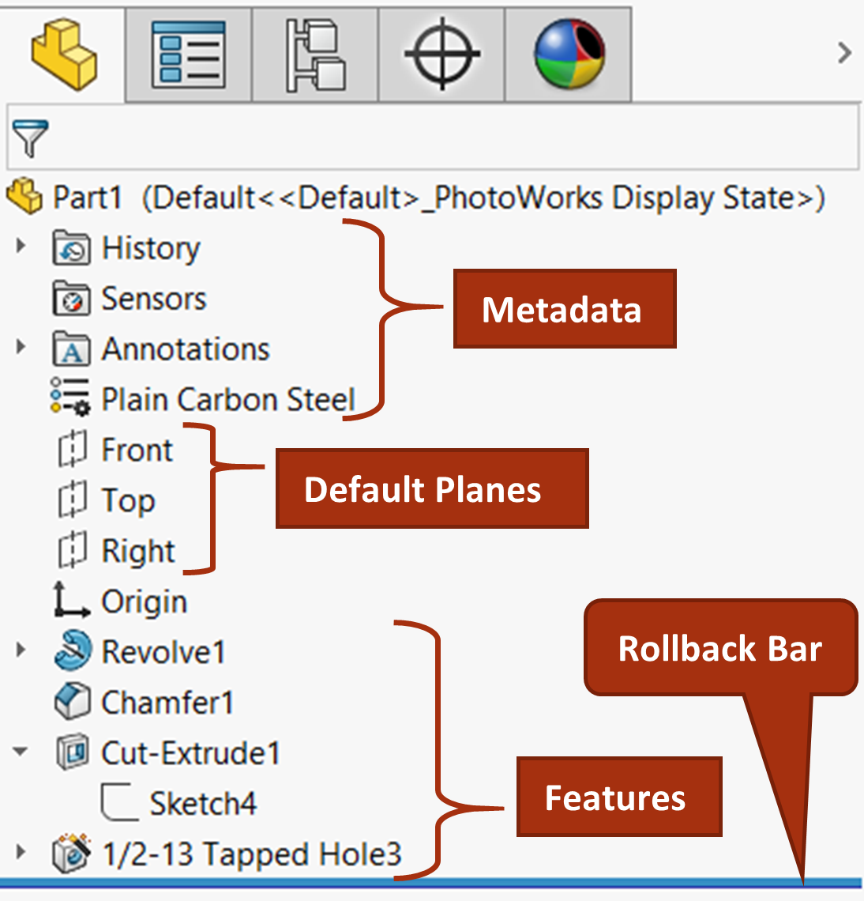

# Lección [Número]: [Título en Español] / [Title in English]

**Fecha:** DD-MM-YYYY 
**Tema Principal / Core Topic:** [e.g., Operación de Revolución / Revolve Feature]

---

## 1. Glosario y Ubicación Rápida (Bilingual Tool Glossary)
*Registra aquí las herramientas clave utilizadas en esta sesión con su equivalente bilingüe y su ubicación.*

*   **[Herramienta en Español]** ([English Tool Name])
    *   *Ubicación / Location:* [e.g., Administrador de Comandos > Croquis]
    *   *Atajo / Gesto:* [e.g., Tecla S / Gestos del Ratón]
    *   *Función Clave / Receta:* [Breve nota de qué hace o paso a paso para ejecutarla]

---

## 2. FeatureManager & Lógica del Árbol (Tree Structure)
*Captura visual o estructura de cómo se construyó la pieza (capas, revoluciones, cortes, etc.)*

  

*   **Estrategia de Modelado / Intención de Diseño:** [Breve nota de por qué se eligió esta estructura y no otra]

---

## 3. Tips, Trucos y Hacks de Velocidad (Speed Hacks)
*Hacks específicos aprendidos durante el modelado práctico de esta sesión:*

*   **Truco de Interfaz:** [e.g., Cambiar unidades rápido desde la Barra de Estado]
*   **Atajo de Teclado:** [e.g., Tecla D para acercar confirmación / Ctrl + 8 para Normal a la Vista]
*   **Maña de Operación:** [e.g., Usar 'Hasta la superficie' en vez de profundidad fija para asociatividad]

---

## 4. ⚠️ Troubleshooting y Errores Comunes
*¿Qué falló hoy o qué error cometí durante el ejercicio que me hizo perder tiempo?*

*   **Problema / Síntoma:** [e.g., La operación Revolución generó una Operación Lámina (Thin Feature)]
*   **Causa y Solución:** [e.g., Faltó la línea sólida de cierre sobre la línea constructiva en la base del croquis]

