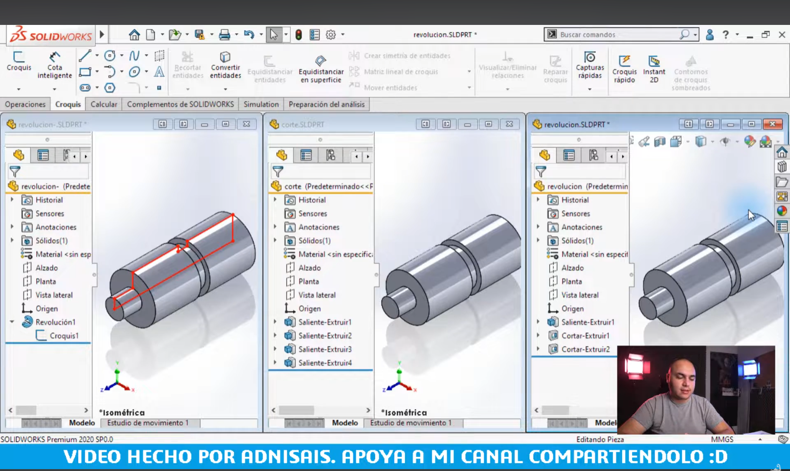

# Lección 1: Introducción y Fundamentos del CAD / Introduction and CAD Fundamentals
**Fecha:** 31-08-2026 
**Tema Principal / Core Topic:** Conceptos Esenciales de SolidWorks y la "Ingeniería del Diseño"

---

## 1. Glosario Bilingüe de Herramientas (Bilingual Tool Glossary)
En SolidWorks, la comunicación industrial en México exige dominar los términos tanto en español (por el curso) como en inglés (usado en la industria y el examen CSWA).

*   **Operaciones Croquizadas** (Sketched Features)
    *   *Ubicación / Location:* Administrador de Comandos > Operaciones (Features)
    *   *Función Clave:* Operaciones 3D que dependen de un croquis (boceto en 2D) como base. 
    *   *Ejemplos:* Extruir saliente/base (Extruded Boss/Base), Revolución de saliente/base (Revolved Boss/Base).
*   **Operaciones Aplicadas** (Applied Features)
    *   *Ubicación / Location:* Administrador de Comandos > Operaciones (Features)
    *   *Función Clave:* Operaciones que se aplican directamente sobre la geometría 3D existente del modelo, sin requerir un croquis nuevo.
    *   *Ejemplos:* Redondeo (Fillet), Chaflán (Chamfer), Ángulo de salida (Draft).
*   **Cotas Conductoras** (Driving Dimensions)
    *   *Ubicación / Location:* Herramientas de Croquis > Cota Inteligente (Smart Dimension)
    *   *Color en Pantalla:* **Negro** (cuando el croquis está completamente definido).
    *   *Función Clave:* Son las cotas paramétricas que mandan y controlan directamente el tamaño del objeto.
*   **Cotas Conducidas** (Driven Dimensions)
    *   *Ubicación / Location:* Se crean automáticamente al intentar acotar una geometría ya completamente definida.
    *   *Color en Pantalla:* **Gris**.
    *   *Función Clave:* Sirven únicamente como referencia visual o de lectura informativa. No controlan la geometría; se recalculan solas cuando cambian las cotas conductoras.

---

## 2. Los 5 Pilares de SolidWorks (The 5 Core Concepts)
SolidWorks se rige por cinco conceptos de comportamiento esenciales que diferencian el diseño profesional del modelado empírico:

### A. Modelado Basado en Operaciones (Feature-Based Modeling)
*   **Definición:** El modelo se construye mediante una serie de pasos secuenciales u operaciones lógicas que quedan registradas en un historial (FeatureManager o árbol de operaciones).
*   **Analogía de Fabricación:** En lugar de deformar el material libremente como plastilina o arcilla, modelar en SolidWorks simula el proceso de manufactura real. Por ejemplo, para hacer una pieza metálica, primero se extruye una placa de metal base, luego se suelda un cilindro y finalmente se maquila un corte.

### B. Modelado Paramétrico (Parametric Modeling)
*   **Definición:** El control geométrico de la pieza se realiza mediante parámetros:
    1.  **Relaciones Geométricas / Restricciones:** Controlan la **forma** y el comportamiento geométrico (p. ej., horizontal, vertical, colineal, perpendicular, igual). Se pueden aplicar de forma automática al dibujar o de forma manual.
    2.  **Cotas / Dimensiones:** Controlan exclusivamente el **tamaño**.
*   **Regla de Oro en SolidWorks:** Primero define la **forma** (usando relaciones y bosquejo general) y después define el **tamaño** (aplicando cotas).

### C. Modelado Sólido (Solid Modeling)
*   **Definición:** A diferencia de los primeros programas CAD que representaban objetos mediante vectores tridimensionales sin área ni volumen, o programas basados únicamente en cascarones vacíos (superficies), SolidWorks crea **sólidos reales con volumen físico**.
*   **Ventajas en Ingeniería:**
    *   Cálculo automático de volumen, área, masa, peso y centro de gravedad al asignar la densidad del material seleccionado.
    *   **Simulación Virtual (FEA):** Permite realizar análisis de esfuerzos internos para determinar si la pieza resistirá las condiciones del mundo real antes de fabricarla, utilizando las propiedades mecánicas reales del material (como el límite elástico y el módulo elástico).

### D. Modelado Asociativo (Associative Modeling)
*   **Definición:** SolidWorks mantiene una conexión bidireccional y activa entre sus tres tipos de archivos estándar:
    $$\text{Pieza (Part)} \longleftrightarrow \text{Ensamble (Assembly)} \longleftrightarrow \text{Dibujo 2D (Drawing)}$$
*   **Comportamiento:** Si modificas el diámetro de un barreno en el archivo de la *Pieza*, la modificación se actualizará automáticamente en el *Ensamble* donde está insertada y en el plano de fabricación del *Dibujo 2D*. Del mismo modo, si cambias la cota conductora desde el plano de *Dibujo 2D*, el cambio se propagará a la *Pieza* y al *Ensamble*.
*   **Ventaja Competitiva:** Minimiza drásticamente el error humano de manufactura provocado por planos desactualizados.

### E. Intención de Diseño (Design Intent)
*   **Definición:** Es la forma en que se debe comportar el modelo geométrico cuando se le aplican modificaciones o cambios de dimensiones.
*   **El Arte de Acotar (Caso de los Marcos Concentricos):** En un ejercicio con un marco exterior de $200 \times 150 \text{ mm}$ y un marco interior:
    *   *Si acotas el marco interno con un desfase constante de $20 \text{ mm}$ desde la orilla:* Al crecer la longitud exterior a $220 \text{ mm}$, el marco interno crece automáticamente para mantener la separación constante de $20 \text{ mm}$.
    *   *Si acotas el marco interno con una cota conductora fija de $160 \text{ mm}$ de longitud:* Al cambiar el marco exterior, el marco interno permanece rígido y del mismo tamaño, alterando la simetría visual del diseño.
    *   *Conclusión:* Tus cotas deben reflejar cómo quieres que reaccione el objeto al cambiar.

---

## 3. FeatureManager (Estructura Lógica del Árbol)
Visualizar el árbol es clave para dominar la jerarquía de reconstrucción en el CSWA. Aquí tienes un mapa conceptual de cómo se estructuraron las comparativas de operaciones en Lección 1.8:

<p align="center">
  
</p>

---

## 4. El Test del Jefe Bipolar (The Bipolar Boss Test)
El "Jefe Bipolar" es un recordatorio de que los cambios de diseño en la industria real ocurren en segundos y sin previo aviso.

```text
  💬 "¡Rápido! Cambia la mesa a cuadrada con patas triangulares... 
      ¡No, espera! Mejor que sea una mesa triangular con base circular!" 
                                             — El Jefe Bipolar
```

### El Experimento de las Tres Piezas Cilíndricas (Lección 1.8)
Se construyeron tres piezas con geometrías idénticas pero usando tres lógicas de reconstrucción distintas. Posteriormente, se simuló una orden de cambio: **"Quitar el cilindro de la punta de la pieza"**.

| Método de Modelado | Esfuerzo Inicial | Proceso de Modificación (El Cambio) | Comportamiento en el Test |
| :--- | :--- | :--- | :--- |
| **1. Revolución (Revolve)** | **Bajo** (1 solo croquis y 1 operación) | Complejo. Requiere editar el croquis original, borrar la punta, recortar excedentes, recrear relaciones y cerrar el contorno. | ❌ **Rígido.** El cambio altera el croquis maestro de forma destructiva. |
| **2. Por Capas (By Layers)** | **Alto** (4 croquis y 4 operaciones de extrusión) | Extremadamente rápido. Solo se selecciona la operación de la punta en el FeatureManager y se elimina/suprime. |  **Altamente Flexible.** El modelo absorbe el cambio en dos clics. |
| **3. Por Desbaste (Subtractive)** | **Medio** (Inicia con barra sólida y corta material) | Requiere crear un nuevo croquis de corte y realizar una operación de extruir corte. | ⚠️ **Intermedio.** Agrega operaciones extras sobre operaciones previas. |

### La Gran Lección de la "Ingeniería del Diseño"
*   **La trampa de la eficiencia inicial:** Lo que parece más rápido al empezar (Revolución) muchas veces resulta ser lo más rígido a la hora de hacer cambios.
*   **Planificación estratégica:** Antes de modelar, pregúntate cómo se va a fabricar, cómo se va a ensamblar y qué cambios es probable que te pidan.
*   **Enfoque híbrido:** Puedes combinar lo mejor de ambos mundos: modelar el cuerpo base de la pieza con una Revolución para mayor velocidad, y agregar la sección modificable como una extrusión independiente por Capas para tener la flexibilidad de suprimirla o modificarla sin alterar el cuerpo principal.

---

## 5. Tips de Automatización y Hacks de Velocidad (Speed Hacks)
*   **Toma de Decisiones de Arquitectura:** En proyectos complejos de diseño bajo pedido o automatización, es común tardarse más tiempo planificando la estructura del modelo que dibujando en el software (p. ej., dedicar hasta dos semanas exclusivamente a estructurar ecuaciones y configuraciones antes de tirar la primera línea de croquis).
*   **Uso Inteligente de Ecuaciones:** El examen CSWP y el diseño industrial avanzado utilizan ecuaciones globales vinculadas a las cotas conductoras para cambiar automáticamente diámetros, espaciamientos, anchos de bases de estructuras y cantidades de elementos en una matriz (p. ej., escalar de 2 a 4 niveles estructurales, o de 5 a 8 componentes automáticamente sin que la geometría colapse).
*   **Uso de Control + Z:** En el modelado rápido, SolidWorks te permite usar `Ctrl + Z` para revertir operaciones eliminadas o croquis alterados destructivamente, devolviendo la pieza a su estado estable anterior de forma instantánea.
