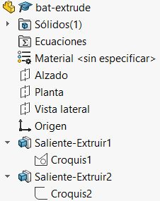
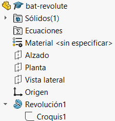

# Lección 2: Interfaz de Usuario, Creación de Pieza y Revolución / User Interface, Part Creation & Revolve Feature

**Fecha:** 31-08-2026
**Tema Principal / Core Topic:** Conceptos de Interfaz de SolidWorks, Modelado por Capas (Extrusión) y Modelado por Revolución (Revolve).

---

## 1. Glosario Bilingüe de Herramientas (Bilingual Tool Glossary)

En el entorno industrial y la certificación CSWA, conocer los nombres de los comandos en ambos idiomas es crucial.

*   **Administrador de Comandos** (CommandManager / Ribbon):
    *   *Ubicación:* Barra superior de SolidWorks.
    *   *Función Clave:* Cinta de opciones organizada en pestañas visuales que muestra los comandos disponibles para Croquis, Operaciones, etc.. En versiones como SolidWorks 2020, al pasar el cursor sobre un comando se despliega una animación y explicación de su uso.
*   **Gestor de Diseño / Árbol de Operaciones** (FeatureManager Design Tree):
    *   *Ubicación:* Panel lateral izquierdo.
    *   *Función Clave:* El historial cronológico de operaciones que construyen la pieza. Es donde se administran planos de referencia, croquis y operaciones aplicadas.
*   **PropertyManager (Gestor de Propiedades):**
    *   *Ubicación:* Pestaña secundaria en el área izquierda.
    *   *Función Clave:* Muestra y permite configurar los parámetros específicos de la operación, croquis o entidad seleccionada.
*   **ConfigurationManager (Gestor de Configuraciones):**
    *   *Ubicación:* Pestaña secundaria en el área izquierda.
    *   *Función Clave:* Permite crear múltiples versiones o tamaños de una misma pieza en un solo archivo (por ejemplo, definir pilas AAA, AA, C y D bajo un mismo archivo).
*   **DimXpert / TolAnalyst:**
    *   *Función Clave:* Herramienta para agregar tolerancias geométricas y dimensionales en 3D. TolAnalyst realiza análisis de apilamiento de tolerancias (tolerance stackup) para garantizar que las piezas encajen en el ensamble real.
*   **DisplayManager (Gestor de Visualización):**
    *   *Función Clave:* Administra apariencias, calcomanías (decals), luces, cámaras y configuraciones de renderizado (PhotoView 360).
*   **Panel de Tareas** (Task Pane):
    *   *Ubicación:* Extremo derecho de la pantalla.
    *   *Función Clave:* Acceso rápido a la Biblioteca de Diseño (Design Library), Explorador de Archivos, Paleta de Vistas (View Palette, para planos 2D) y la biblioteca de apariencias y escenas.
*   **Barra de Estado** (Status Bar):
    *   *Ubicación:* Esquina inferior derecha.
    *   *Función Clave:* Indica el estado de edición ("Editando croquis") y sirve como un **atajo rápido** para cambiar el sistema de unidades (MMGS, IPS, etc.) sin abrir las propiedades del documento.

---

## 2. FeatureManager (Árbol de Operaciones)

En esta sesión se comparan dos estructuras lógicas diferentes para modelar exactamente el mismo sólido: una pila de tamaño D.

### Opción A: Método por Capas (By Layers / Stacked Extrusions)
Este método utiliza extrusiones sucesivas añadidas sobre las caras planas creadas por las operaciones previas.

  

### Opción B: Método por Revolución (Revolve Feature)
Este método crea todo el cuerpo cilíndrico en una sola operación haciendo girar la mitad del perfil (croquis cerrado) 360 grados alrededor de un eje de simetría (línea constructiva).

  

---

## 3. Tips, Trucos y Hacks de Velocidad (Speed Hacks)

*   **Rotación Rápida con Mouse:** Haz clic sostenido en el botón central del mouse (la rueda de desplazamiento/scroll) y arrastra para rotar la vista 3D instantáneamente.
*   **Atajo de Unidades:** Si iniciaste una pieza y notas que las dimensiones están en la escala incorrecta (ej. pulgadas en vez de milímetros), haz clic en el selector de unidades de la **Barra de Estado** (abajo a la derecha) para alternar al instante.
*   **Evitar Arrastres Innecesarios:** Al extruir, escribe directamente el valor numérico en el PropertyManager (ej. 58 mm o 3 mm) en lugar de arrastrar la flecha del manipulador en pantalla, lo cual consume más tiempo de precisión.
*   **Auto-cierre de Revolución:** Si olvidas trazar la línea sólida de cierre sobre la línea constructiva, dile "Sí" a la advertencia de SolidWorks: *"¿Desea cerrar el croquis automáticamente?"* para que inserte la línea faltante y genere un sólido macizo en lugar de una operación de lámina.
