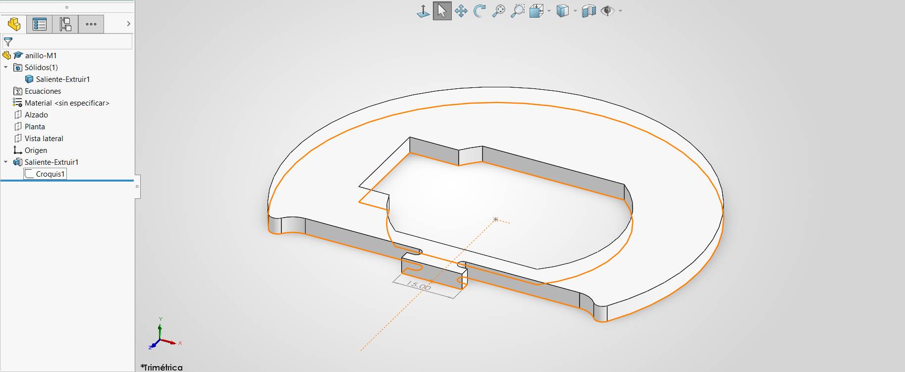

### Lección 3: Consejos de Croquis / Sketch Tips and Tricks
**Fecha:** 04-09-2026  **Tema Principal / Core Topic:** Croquizado Complejo y Modularidad (Anillo de Motor / Motor Ring)

--------------------------------------------------------------------------------

#### 1. Glosario y Ubicación Rápida (Bilingual Tool Glossary)
*Registra aquí las herramientas clave utilizadas en esta sesión con su equivalente bilingüe y su ubicación.*

*   **Simetría Dinámica de Entidades** (Dynamic Mirror Entities)
    *   *Ubicación / Location:* Herramientas > Herramientas de croquizar > Simetría dinámica de entidades (o buscando "simetría" con acento en el buscador de comandos).
    *   *Atajo / Gesto:* Buscador de comandos (esquina superior derecha).
    *   *Función Clave / Receta:* Crea simetría en tiempo real de las entidades que vas dibujando a partir de una línea constructiva seleccionada como eje. No borra ni modifica de forma simétrica; solo añade elementos nuevos.
*   **Recorte Inteligente** (Power Trim / Trim Entities)
    *   *Ubicación / Location:* Administrador de Comandos > Croquis > Recortar entidades.
    *   *Atajo / Gesto:* Tecla rápida o barra de herramientas de croquis.
    *   *Función Clave / Receta:* Permite trazar un lazo libre en pantalla; cualquier entidad de croquis que cruce la línea gris del lazo se recortará automáticamente hasta la intersección más cercana.
*   **Relación de Igualdad** (Equal Relation)
    *   *Ubicación / Location:* Seleccionar dos o más entidades de croquis > Agregar relaciones > Igual.
    *   *Atajo / Gesto:* Menú contextual rápido al seleccionar múltiples entidades con la tecla Ctrl o Shift.
    *   *Función Clave / Receta:* Fuerza a que múltiples círculos, arcos o líneas mantengan siempre el mismo diámetro, radio o longitud. Evita la sobre-acotación redundante.
*   **Arco Tangente Rápido** (Instant Tangent Arc Shortcut)
    *   *Ubicación / Location:* Herramientas > Entidades de croquis > Arco tangente.
    *   *Atajo / Gesto:* Mientras dibujas una línea, regresa el cursor al punto de inicio y vuelve a sacarlo; se transformará automáticamente en un arco tangente.
    *   *Función Clave / Receta:* Dibuja arcos tangentes sobre la marcha sin necesidad de salir de la herramienta de línea, agilizando el flujo de trabajo drásticamente.

--------------------------------------------------------------------------------

#### 2. FeatureManager & Lógica del Árbol (Tree Structure)
*Captura visual o estructura de cómo se construyó la pieza (capas, revoluciones, cortes, etc.)*

  

*   **Estrategia de Modelado / Intención de Diseño:** 
    *   **Selección del Plano:** Se seleccionó el **Plano Planta (Top Plane)** porque, aunque la pieza se visualiza de frente en el plano 2D, en el ensamble real del robot irá acostada horizontalmente. Diseñar en el plano correcto desde el inicio facilita enormemente las relaciones de ensamble posteriores.
    *   **¿Todo en un solo croquis?** Aunque en este ejercicio introductorio el instructor dibujó la geometría exterior e interior dentro de un mismo croquis (Croquis1), se advierte que en el diseño industrial profesional esto es una mala práctica. Agrupar demasiadas entidades en un solo croquis genera confusión visual y disminuye la flexibilidad para la automatización o configuraciones del diseño (por ejemplo, si se requiere intercambiar el corte de este motor por otro modelo).

--------------------------------------------------------------------------------

#### 3. Tips, Trucos y Hacks de Velocidad (Speed Hacks)
*Hacks específicos aprendidos durante el modelado práctico de esta sesión:*

*   **Truco de Interfaz (Buscador de Comandos):** Para encontrar herramientas que no usas comúnmente como la "Simetría dinámica de entidades", utiliza la barra de búsqueda de la esquina superior derecha configurada en "Comandos". Ojo: SolidWorks es muy estricto con la ortografía en español; debes escribir "simetría" con acento para encontrarla.
*   **Atajo de Teclado (Línea Única de un Solo Clic):** Si en lugar de dar clics individuales das un clic sostenido, arrastras y sueltas, SolidWorks creará una sola línea independiente en lugar de iniciar una cadena continua de líneas. Esto te evita tener que presionar la tecla Esc constantemente.
*   **Maña de Operación (Prototipado Seguro / Modelado por Fuera):** Para modelar geometrías que no son concéntricas (como el círculo descentrado de radio 27 y sus pestañas), lo mejor es dibujarlas y acotarlas completamente por fuera de la pieza principal. Una vez que este "prototipo" tiene sus dimensiones estables, arrástralo y ánclalo al origen o a la constructiva. Esto evita que la geometría se decolore o colapse al mover puntos libres.
*   **El Atajo Shift para Tangencias:** Al acotar la distancia mínima o máxima entre dos arcos (como la cota de 9 mm en la ranura), mantén presionada la tecla Shift mientras seleccionas ambos arcos. Esto fuerza a SolidWorks a colocar la cota entre las tangencias exteriores/interiores de los arcos en lugar de hacerlo de centro a centro de forma predeterminada.
*   **Tangencia en un Punto:** En lugar de seleccionar ambos arcos con Ctrl/Shift para añadir tangencia, simplemente selecciona el punto de conexión (vértice común) donde convergen ambas curvas y haz clic en la relación de tangencia en el menú emergente.

--------------------------------------------------------------------------------

#### 4. ⚠️ Troubleshooting y Errores Comunes
*¿Qué falló hoy o qué error cometí durante el ejercicio que me hizo perder tiempo?*

*   **Problema / Síntoma:** El comando de "Simetría dinámica de entidades" no copia los recortes de líneas o los redondeos aplicados.
    *   *Causa y Solución:* La simetría dinámica es una herramienta de adición en tiempo real; no realiza un rastreo activo de eliminaciones (como borrar un segmento con Recorte Inteligente) o de modificaciones posteriores (como redondeos de croquis). La solución es aplicar primero los recortes necesarios de forma manual en ambos lados y realizar los redondeos una vez terminada la simetría básica.
*   **Problema / Síntoma:** Al arrastrar un croquis descentrado para posicionarlo, la figura se distorsiona por completo, estirando líneas y perdiendo la forma inicial.
    *   *Causa y Solución:* La figura no tenía cotas o relaciones geométricas internas suficientes antes de ser arrastrada ("desbarajuste" de geometría libre). Para solucionarlo, acota internamente tu perfil primero y define relaciones de simetría (por ejemplo, con respecto a una constructiva) antes de conectarlo a la geometría principal.
*   **Problema / Síntoma:** Error de Escala al acotar círculos grandes.
    *   *Causa y Solución:* Confundir el Radio con el Diámetro en las cotas de los planos. Siempre revisa si la anotación indica un radio (R) o un diámetro (Ø) para evitar que tu modelo quede al doble o a la mitad del tamaño de diseño real.
