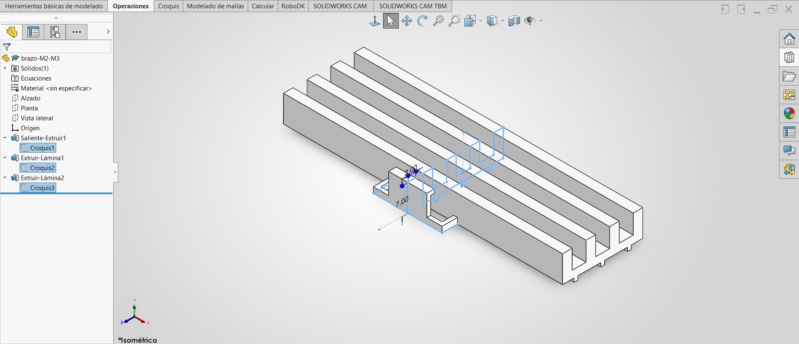

### Lección 4: Simetría de Croquis / Sketch Mirror
**Fecha:** 04-09-2026  **Tema Principal / Core Topic:** Simetría de Croquis y Operación Lámina / Sketch Mirror & Thin Feature

--------------------------------------------------------------------------------

#### 1. Glosario y Ubicación Rápida (Bilingual Tool Glossary)
*   **Simetría de Entidades** (Mirror Entities)
    *   *Ubicación / Location:* Administrador de Comandos > Croquis (CommandManager > Sketch)
    *   *Atajo / Gesto:* Gestos del Ratón / Barra de herramientas de Croquis
    *   *Función Clave / Receta:* Crea una copia simétrica de las entidades de croquis seleccionadas con respecto a una línea constructiva o eje de referencia.
*   **Líneas de Inferencia** (Inference Lines)
    *   *Ubicación / Location:* Visualización automática durante el croquizado
    *   *Atajo / Gesto:* Aparecen de forma dinámica al alinear puntos o líneas
    *   *Función Clave / Receta:* Guías visuales que ayudan a alinear entidades. Las amarillas agregan relaciones geométricas automáticas (como horizontal, vertical o perpendicular), mientras que las azules funcionan como enganches o imanes visuales (*snaps*) sin forzar relaciones fijas.
*   **Operación Lámina** (Thin Feature)
    *   *Ubicación / Location:* Administrador de Comandos > Operaciones > Extruir saliente/base
    *   *Atajo / Gesto:* Se activa automáticamente al intentar extruir un contorno abierto
    *   *Función Clave / Receta:* Permite dar un espesor de pared controlado a un croquis (hacia adentro, hacia afuera o simétrico) sin necesidad de dibujar un perfil cerrado de doble línea.
*   **Plano Medio** (Mid Plane)
    *   *Ubicación / Location:* Propiedades de Extrusión > Condición Final (Direction 1 > End Condition)
    *   *Atajo / Gesto:* Menú desplegable de dirección en extrusiones
    *   *Función Clave / Receta:* Extruye la geometría de manera simétrica hacia ambos lados del plano del croquis dividiendo el espesor total entre dos.
*   **Editar Plano de Croquis** (Edit Sketch Plane)
    *   *Ubicación / Location:* FeatureManager > Clic derecho sobre el icono del Croquis
    *   *Atajo / Gesto:* Menú contextual del árbol de operaciones
    *   *Función Clave / Receta:* Reubica un croquis completo y todas sus operaciones asociadas a un plano o cara plana diferente sin necesidad de borrar o volver a dibujar la geometría.

--------------------------------------------------------------------------------

#### 2. FeatureManager & Lógica del Árbol (Tree Structure)

  

*   **Estrategia de Modelado / Intención de Diseño:**
    *   **Orientación Inicial:** Se selecciona el **Plano Vista Lateral (Right Plane)** para el Croquis 1, de modo que el brazo robótico mantenga su orientación de montaje correcta por defecto en el espacio 3D.
    *   **Extrusión Simétrica:** Se utiliza la condición final de **Plano Medio (Mid Plane)** en todas las extrusiones. Esto mantiene el origen absoluto `(0,0,0)` exactamente en el centro geométrico de la pieza. En la fase de ensamble, esto permite alinear y centrar piezas usando los planos del origen sin necesidad de calcular distancias o añadir relaciones de posición (*mates*) complejas de manera manual.
    *   **Eficiencia de Croquizado:** En lugar de dibujar perfiles con formas de "C" o "U" cerrados (que requieren trazar líneas internas paralelas y cerrar tapas), se dibujan como **Contornos Abiertos** simples y se extruyen usando la **Operación Lámina (Thin Feature)**. Esto reduce el número de cotas y líneas de croquis a la mitad, facilitando cambios rápidos de espesor.

--------------------------------------------------------------------------------

#### 3. Tips, Trucos y Hacks de Velocidad (Speed Hacks)
*   **Truco de Interfaz (El Número Mágico de los Gestos del Ratón):** Puedes configurar tus Gestos del Ratón (*Mouse Gestures*) para mostrar hasta 8 comandos en la rueda en lugar de 4. Se configura haciendo clic derecho en cualquier barra de herramientas > *Personalizar* > pestaña *Movimientos del ratón*. Esto te da acceso directo y veloz a herramientas comunes (como Cota Inteligente o Círculo) con un simple arrastre del clic derecho.
*   **Atajo de Teclado (Vistas Rápidas):** Usa los atajos de teclado estándar para reorientar tu vista al instante en lugar de usar el menú de orientación:
    *   `Ctrl + 1`: Vista Frontal (Front)
    *   `Ctrl + 5`: Vista Superior (Top)
    *   `Ctrl + 7`: Vista Isométrica (Isometric)
    *   `Ctrl + 8`: Normal a la vista de croquis (Normal To)
*   **Maña de Operación (Simetría en un Solo Clic):** Si dibujas solo la mitad de tu perfil simétrico y agregas una línea constructiva de referencia, puedes hacer el espejo automáticamente en un paso rápido: haz un cuadro de selección cruzada de derecha a izquierda (cuadro verde) para seleccionar todas las entidades del croquis y la línea constructiva. Si el programa detecta exactamente **una línea constructiva** dentro de la selección masiva, al pulsar "Crear simetría de entidades" SolidWorks aplicará la simetría de inmediato sin abrir ventanas emergentes ni pedirte que selecciones el eje de simetría de forma manual.
*   **Maña de Operación (Uso de relaciones Colineales):** Cuando tengas bordes o repisas que deben alinearse físicamente a la misma altura o posición a ambos lados de la pieza, utiliza la relación geométrica **Colineal** seleccionando ambas líneas con la tecla `Ctrl`. Es más rápido, limpio y estéticamente robusto que colocar cotas de altura idénticas en cada lado.

--------------------------------------------------------------------------------

#### 4. ⚠️ Troubleshooting y Errores Comunes
*   **Problema / Síntoma:** Te das cuenta de que creaste el croquis en un plano o cara incorrectos (por ejemplo, modelaste la pestaña en forma de "C" en el Plano Planta desde abajo, en lugar de hacerlo desde la cara superior de la pieza base, provocando que la extrusión se desfase o flote).
*   **Causa y Solución:** Error de selección al abrir el croquis inicial. No borres el croquis ni vuelvas a empezar. Para solucionarlo rápidamente:
    1.  Haz clic derecho sobre el icono del **Croquis** en el FeatureManager (árbol de operaciones).
    2.  Selecciona la opción **Editar plano de croquis** (Edit Sketch Plane).
    3.  En la ventana de selección, desmarca el plano actual y haz clic sobre la cara o plano correcto en el modelo 3D.
    4.  Acepta el cambio. La geometría del croquis y la extrusión se desplazarán por arte de magia a su nueva ubicación. *Nota:* Esto funciona de manera impecable si el croquis original fue referenciado adecuadamente al origen o a entidades que se trasladan con la operación.
