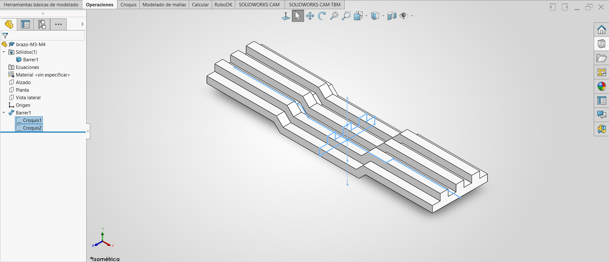

# Lección 5: Barridos / Swept Features
**Fecha:** 04-09-2026  **Tema Principal / Core Topic:** Operación de Barrido (Swept Boss/Base) y Relaciones Avanzadas

--------------------------------------------------------------------------------

#### 1. Glosario y Ubicación Rápida (Bilingual Tool Glossary)
*   **Saliente/Base Barrido** (Swept Boss/Base)
    *   *Ubicación / Location:* Administrador de Comandos > Operaciones (Features CommandManager)
    *   *Función Clave / Receta:* Crea una operación 3D extruyendo un perfil cerrado a lo largo de una trayectoria. Requiere forzosamente dos croquis independientes: un **Croquis de Perfil** (sección transversal constante) y un **Croquis de Trayecto** (el camino que sigue en el espacio).
*   **Relación de Perforar** (Pierce Relation)
    *   *Ubicación / Location:* Al seleccionar un punto del croquis del perfil y una línea/curva del trayecto en modo de edición de croquis.
    *   *Función Clave / Receta:* Restringe el perfil para que "atraviese" de forma exacta el trayecto. Es crucial en barridos para evitar que la geometría se desfase, se deforme o se comporte de manera errática al deslizarse por la trayectoria.
*   **Fusionar caras tangentes** (Merge Tangent Faces)
    *   *Ubicación / Location:* Panel de propiedades de la operación Barrido > Opciones (Sweep PropertyManager > Options)
    *   *Función Clave / Receta:* Cuando está activo, SolidWorks une las superficies adyacentes continuas en una sola cara lisa y unificada. Si se desactiva, las caras se mantienen como caras independientes divididas por aristas, lo que dificulta la selección posterior para redondeos o croquizados.

--------------------------------------------------------------------------------

#### 2. FeatureManager & Lógica del Árbol (Tree Structure)
Para la pieza de la Palanca se utilizó una estrategia de modelado simétrico en ambas direcciones basada en barrido:

  

*   **Estrategia de Modelado / Intención de Diseño:** 
    *   **Simetría Bidireccional:** La pieza es simétrica de izquierda a derecha (tanto de lado como de frente). Al crear el perfil justo en el plano central y extruir/barrer en **ambos sentidos (dirección bidireccional)**, la pieza queda perfectamente centrada sobre el origen absoluto.
    *   **Orden de los Croquis (Moderno vs. Antiguo):** Históricamente (versiones previas a 2017), se recomendaba dibujar primero el trayecto para poder crear un plano de referencia perpendicular en el extremo e iniciar ahí el perfil. Con las versiones modernas de SolidWorks, es posible dibujar el perfil primero y hacer un barrido bidireccional desde el centro de la trayectoria, optimizando pasos y planos auxiliares.
    *   **Proceso de Diseño Recomendado:** Dibujar primero todas las entidades físicas del croquis, después agregar relaciones geométricas y al final añadir cotas numéricas. Esto evita que el croquis colapse o se cruce al ser acotado.

--------------------------------------------------------------------------------

#### 3. Tips, Trucos y Hacks de Velocidad (Speed Hacks)
*   **Truco de Interfaz (Atajo de Selección Dinámica):** Para seleccionar rápidamente todos los elementos de un lado y aplicar simetría: haz una ventana de selección de **derecha a izquierda** (cuadro verde). Esto seleccionará todas las líneas que toque el cuadro y la línea constructiva central. Al hacer clic directamente en "Crear simetría de entidades", SolidWorks genera el espejo automáticamente sin pedirte seleccionar el eje.
*   **Atajo de Teclado (Vistas Estándar del Teclado):** Utiliza los números de la hilera superior del teclado (no el teclado numérico de la derecha) combinados con `Ctrl` para cambiar de vista de forma inmediata:
    *   `Ctrl + 1` = Vista Frontal (Front)
    *   `Ctrl + 2` = Vista Posterior (Back)
    *   `Ctrl + 3` = Vista Izquierda (Left)
    *   `Ctrl + 4` = Vista Derecha (Right)
    *   `Ctrl + 5` = Vista Superior (Top)
    *   `Ctrl + 6` = Vista Inferior (Bottom)
    *   `Ctrl + 7` = Vista Isométrica (Isometric)
    *   `Ctrl + 8` = Vista Normal al plano seleccionado (Normal To)
*   **Maña de Operación (Cota de Ancho Total/Diámetro desde Eje):** Selecciona un punto extremo, haz clic en la línea constructiva central y desplaza el cursor del ratón hacia el lado opuesto del eje de simetría. La cota pasará automáticamente de medir la distancia al centro (radio) a medir la **distancia total reflejada (diámetro/ancho total)**. Al dar clic para colocarla, la propiedad se queda "anclada", permitiéndote acotar de forma rápida el resto de medidas de ancho completo sin repetir el proceso.

--------------------------------------------------------------------------------

#### 4. ⚠️ Troubleshooting y Errores Comunes
*   **Problema / Síntoma:** Al arrastrar un punto o acotar una nueva sección, el croquis se distorsiona de forma extraña, las líneas se cruzan y el perfil pierde su forma lógica ("desbarajuste").
*   **Causa y Solución:** Esto ocurre por no estructurar correctamente las relaciones geométricas antes de acotar. Solución: Antes de aplicar dimensiones numéricas grandes, asegúrate de añadir relaciones de **Igualdad** (Equal) o **Colinealidad** (Collinear) en las secciones simétricas correspondientes para que el modelo mantenga su consistencia estructural básica.
*   **Problema / Síntoma:** Al intentar realizar el barrido, SolidWorks marca un error de reconstrucción o la geometría se deforma y gira en espiral a lo largo de curvas pronunciadas.
*   **Causa y Solución:** Falta una restricción geométrica de comportamiento entre los dos croquis. Solución: En el croquis del perfil, selecciona el punto de origen y asócialo al trayecto aplicando una relación geométrica de **Perforar** (Pierce). Esto actúa como una guía fija que obliga al perfil a deslizarse sin rotar sobre la trayectoria.
*   **Problema / Síntoma:** La operación de Barrido genera líneas divisorias o aristas duras innecesarias a lo largo de las caras de unión del modelo.
*   **Causa y Solución:** Desactivaste la casilla "Fusionar caras tangentes" en las opciones del sweep. Solución: Edita la operación de Barrido, despliega la pestaña de "Opciones" y asegúrate de marcar la casilla **Fusionar caras tangentes** para obtener una superficie continua y estéticamente limpia.
