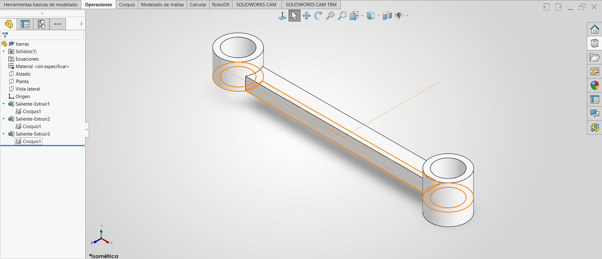

### Lección 6: Selección de Contornos / Contour Selection
**Fecha:** 07-09-2026  **Tema Principal / Core Topic:** Selección de Contornos y Croquis Compartidos (Contour Selection & Shared Sketches)

--------------------------------------------------------------------------------

#### 1. Glosario y Ubicación Rápida (Bilingual Tool Glossary)
*   **Selección de Contornos** (Contour Selection)
    *   *Ubicación / Location:* Administrador de Comandos > Operaciones > Extruir Saliente/Base > Menú desplegable "Contornos seleccionados" (Selected Contours).
    *   *Función Clave / Receta:* Permite extruir o cortar áreas independientes o contornos específicos utilizando un único croquis base, aplicando diferentes alturas o direcciones a cada región.
*   **Croquis Compartido** (Shared Sketch)
    *   *Ubicación / Location:* FeatureManager (Árbol de operaciones), denotado por un icono de "manita" debajo del croquis compartido.
    *   *Función Clave / Receta:* Reutiliza un croquis existente para generar múltiples operaciones 3D independientes, manteniendo la asociatividad paramétrica.
*   **Rectángulo de Centro** (Center Rectangle)
    *   *Ubicación / Location:* Administrador de Comandos > Croquis > Rectángulo > Rectángulo de centro.
    *   *Función Clave / Receta:* Dibuja un rectángulo simétrico partiendo de un punto central (e.g., el Origen), agregando automáticamente líneas constructivas cruzadas diagonales para mantener la simetría paramétrica de las esquinas.
*   **Dirección 2 en Extrusión** (Direction 2 in Extrusion)
    *   *Ubicación / Location:* Panel de propiedades de Extruir Saliente/Base > Casilla "Dirección 2".
    *   *Función Clave / Receta:* Permite extruir un perfil hacia ambos lados del plano de croquis con distancias de profundidad independientes (e.g., 6 mm hacia arriba y 3 mm hacia abajo).
*   **Equidistancia desde Plano de Croquis** (Offset from Sketch Plane)
    *   *Ubicación / Location:* Panel de propiedades de Extruir > Sección "Desde" (From) > Cambiar "Plano de croquis" por "Equidistancia" (Offset).
    *   *Función Clave / Receta:* Desplaza el inicio de la extrusión una distancia determinada por delante o por detrás del plano real donde se dibujó el croquis.

--------------------------------------------------------------------------------

#### 2. FeatureManager & Lógica del Árbol (Tree Structure)
*   **Estructura del Árbol (Modelado de la Pieza con Contornos Seleccionados):**

  

*   **Estrategia de Modelado / Intención de Diseño:**
    *   **Simetría Parcial:** La pieza es simétrica de izquierda a derecha y de arriba a abajo vista desde la Planta, pero asimétrica de perfil (el cilindro izquierdo es más corto y el derecho es más largo, sobresaliendo por debajo).
    *   **¿Por qué un solo croquis?** Al dibujar toda la geometría (placa y círculos) en un único croquis en el Plano Planta, ahorramos tiempo de croquizado y garantizamos que todas las posiciones relativas estén vinculadas. Si se cambia la distancia entre centros de los cilindros, toda la pieza física se actualiza en un solo paso sin riesgo de desalineación.
    *   **Iconos Especiales en el Árbol:** 
        *   *Icono del "Pescadito" (boca abierta):* Indica que la operación 3D se generó seleccionando contornos específicos en lugar del croquis completo.
        *   *Icono de la "Manita" sosteniendo el croquis:* Símbolo del sistema que denota que un elemento (el croquis) está compartido por dos o más operaciones 3D secuenciales. Cualquier cambio de dimensiones en ese único croquis afectará a todas las extrusiones simultáneamente (arma de doble filo).

--------------------------------------------------------------------------------

#### 3. Tips, Trucos y Hacks de Velocidad (Speed Hacks)
*   **Truco de Interfaz (La Tecla S):** Pulsar la tecla `S` en el teclado abre un menú contextual de acceso rápido a herramientas de croquis u operaciones directamente bajo el cursor. Sin embargo, recuerda: **una correcta planeación previa ahorra mucho más tiempo en el examen que cualquier atajo rápido de teclado.**
*   **Atajo de Teclado (Clic y Arrastre en Líneas):** 
    *   Para dibujar la primera línea constructiva, haz clic al principio y clic al final (creando una cadena de líneas).
    *   Para dibujar la segunda línea constructiva sin que SolidWorks siga encadenando trazos automáticamente (y evitar presionar `Esc`), haz **clic sostenido, arrastra y suelta**. Esto corta la cadena de inmediato.
*   **Maña de Operación (Simetría Rápida Verde):** Dibuja los círculos en un extremo y selecciona arrastrando una ventana verde (de derecha a izquierda) que cruce los círculos y la línea constructiva de simetría. Al hacer clic en "Simetría de entidades", SolidWorks detectará automáticamente la línea constructiva como eje de simetría y hará el espejo al instante sin necesidad de abrir y rellenar el panel de propiedades manualmente.
*   **Maña de Extrusión Asimétrica:** Para lograr que un cilindro de 9 mm de largo total sobresalga 6 mm hacia arriba de la placa y 3 mm hacia abajo, puedes resolverlo de dos maneras:
    1.  *Dirección de Extrusión Doble:* Activar Dirección 1 a 6 mm y Dirección 2 a 3 mm.
    2.  *Equidistancia de Plano:* Establecer un desfase (offset) de inicio de 3 mm por debajo del plano de croquis y extruir 9 mm de profundidad en Dirección 1.

--------------------------------------------------------------------------------

#### 4. ⚠️ Troubleshooting y Errores Comunes
*   **Problema / Síntoma:** Al hacer clic en "Extruir Saliente/Base", SolidWorks no muestra ninguna vista previa en color amarillo de la extrusión 3D y el panel de "Contornos Seleccionados" se abre vacío.
*   **Causa y Solución:** 
    *   *Causa:* Tienes líneas empalmadas (duplicadas una encima de otra), contornos abiertos sin cerrar, o el croquis tiene geometrías internas que dividen el boceto en múltiples áreas cerradas independientes, lo que confunde al sistema para decidir qué extruir por defecto.
    *   *Solución:* Selecciona manualmente las áreas específicas o contornos que deseas extruir dentro del cuadro "Contornos seleccionados" en el PropertyManager. Si no se soluciona, revisa si hay líneas superpuestas o esquinas abiertas limpiándolas con "Recorte inteligente".
*   **Problema / Síntoma:** Al intentar hacer una segunda extrusión basada en el croquis compartido, SolidWorks oculta el croquis automáticamente y no permite seleccionarlo fácilmente.
*   **Causa y Solución:**
    *   *Causa:* Por diseño, SolidWorks oculta automáticamente un croquis una vez que se ha utilizado en una operación de extrusión.
    *   *Solución:* Despliega la primera operación en el FeatureManager, haz clic derecho sobre el icono del croquis y selecciona "Mostrar" (icono de ojo). Esto mantendrá el boceto visible en pantalla para que puedas seleccionar fácilmente los siguientes contornos independientes para la segunda y tercera extrusión.
