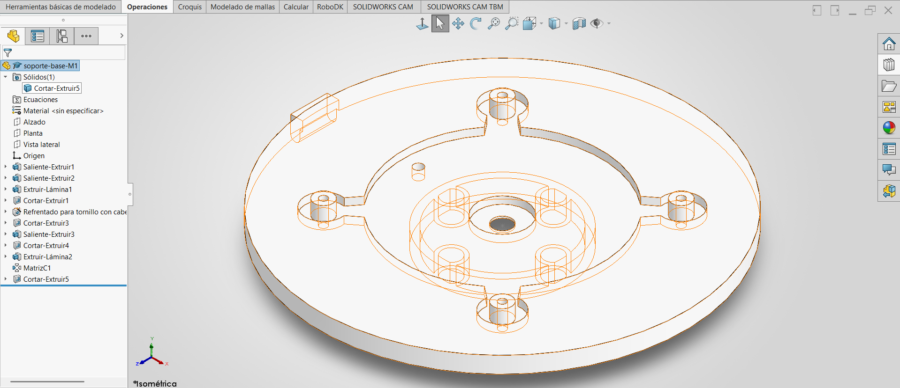

# Lección 7: Matrices / Patterns (Soporte Base M1)
**Tema Principal / Core Topic:** Matriz Circular (Circular Pattern), Operación Lámina (Thin Feature) y Asistente para Taladro (Hole Wizard)

---

## 1. Glosario y Ubicación Rápida (Bilingual Tool Glossary)

*   **Matriz Circular** (Circular Pattern)
    *   *Ubicación / Location:* Administrador de Comandos > Operaciones (Features) > Desplegable de Matriz Lineal
    *   *Atajo / Gesto:* Menú contextual o barra de operaciones rápidas
    *   *Función Clave / Receta:* Duplica operaciones, caras o cuerpos seleccionados de manera equidistante alrededor de un eje, arista circular o cara cilíndrica común.

*   **Operación Lámina** (Thin Feature)
    *   *Ubicación / Location:* Propiedad interna dentro de Extruir Saliente/Base o Extruir Corte
    *   *Atajo / Gesto:* Casilla activa en el PropertyManager de la operación
    *   *Función Clave / Receta:* Da un espesor de pared constante a un perfil (cerrado o abierto) sin necesidad de croquizar dos contornos concéntricos. Ahorra tiempo de croquizado al hacer tubos o bridas cilíndricas.

*   **Asistente para Taladro** (Hole Wizard)
    *   *Ubicación / Location:* Administrador de Comandos > Operaciones (Features)
    *   *Función Clave / Receta:* Crea taladros estandarizados con cajas de refrendado, avellanados o roscas. Utiliza dos pestañas: "Tipo" para definir las dimensiones del barreno y "Posición" para colocarlo en un croquis mediante puntos de referencia.

*   **Convertir Entidades** (Convert Entities)
    *   *Ubicación / Location:* Administrador de Comandos > Croquis (Sketch)
    *   *Función Clave / Receta:* Proyecta aristas de un modelo 3D existente o líneas de otro croquis directamente sobre el plano de croquizado activo, creando líneas sólidas asociativas.

---

## 2. FeatureManager & Lógica del Árbol (Tree Structure)

Para modelar la pieza **Soporte Base M1**, la tentación del principiante es dibujar toda la geometría y todos los barrenos en un único croquis complejo. El instructor advierte fuertemente en contra de esto: pelear con recortes en un solo croquis sobrecarga el diseño y destruye la flexibilidad. La estrategia correcta es modelar una sola sección (un "cuadrante") de forma sencilla y dejar las repeticiones para el final mediante matrices 3D.

  

---

## 3. Tips, Trucos y Hacks de Velocidad (Speed Hacks)

*   **El Mito de la "Tecla S" y la Planificación:** El instructor enfatiza que el verdadero ahorro de tiempo en exámenes como el CSWA no proviene de memorizar atajos rápidos de teclado de manera desesperada, sino de una **correcta planificación previa**. Analizar la pieza y estructurar el árbol de operaciones antes de dar el primer clic evita reconstrucciones fallidas y pérdida de tiempo.
*   **Selección Segura en Matrices:** Al configurar una **Matriz Circular o Lineal**, jamás selecciones las operaciones haciendo clic directo sobre las caras en el modelo 3D. Las caras pueden fusionarse, extenderse o pertenecer a operaciones adyacentes, lo que confunde a SolidWorks y provoca errores de copia. **Regla de Oro:** Despliega el FeatureManager flotante en la pantalla y selecciona las operaciones directamente desde el árbol.
*   **Operación Lámina (Thin Feature) para Ahorrar Círculos:** Para hacer el cilindro inferior hueco (diámetro exterior 36 mm, espesor de pared 2 mm), no dibujes dos círculos concéntricos en el croquis. Dibuja un solo círculo de Ø36 mm y activa la **Operación Lámina** a 2 mm. Asegúrate de verificar la dirección del espesor (debe ir hacia adentro del círculo para respetar el diámetro de 36 mm).
*   **El Atajo Shift para Medidas de Tangencia:** Al acotar la distancia desde una arista cilíndrica, SolidWorks acota por defecto de centro a centro. Para acotar directamente a la tangencia (la parte más externa de la curva), mantén presionada la tecla **`Shift`** mientras seleccionas el arco y la línea de referencia con la herramienta de Cota Inteligente.
*   **Evitar Errores de "Espesor Cero" con Traslapes:** Al modelar la pestañita lateral desde el *Plano Alzado*, la punta de la pestaña toca tangencialmente el cilindro exterior del disco base. Si extruyes exactamente hasta la tangencia exacta, SolidWorks puede fallar con un error geométrico de "Espesor Cero" (Zero-Thickness Geometry). El truco consiste en dibujar un "cachito" extra de material que penetre ligeramente dentro del cuerpo del disco; al extruir, ambos cuerpos se fusionarán de manera limpia y sólida sin dejar caras vacías.
*   **"Hasta el Siguiente" (Up to Next) en Superficies Curvas:** Al extruir el pequeño cilindro hueco inferior que está desfasado 28 mm del centro, la base sobre la que se asienta es curva. Si usas una profundidad fija, el cilindro quedará volando o penetrará demasiado. La solución es configurar la condición final de la extrusión como **Hasta el Siguiente**. SolidWorks extenderá el cilindro adaptándolo perfectamente a la curvatura de la base.
*   **Copiar Operaciones Rápidamente con la Tecla Ctrl:** Si necesitas duplicar un corte o un barreno en otra cara plana independiente, mantén presionada la tecla **`Ctrl`**, haz clic sobre la operación en el árbol y arrástrala hacia la cara de destino. SolidWorks creará una copia de la operación y de su croquis de manera independiente, permitiéndote editar sus relaciones de posición y cotas sin afectar el elemento original.

---

## 4. ⚠️ Troubleshooting y Errores Comunes

*   **Problema / Síntoma: Errores de reconstrucción al aplicar la Matriz Circular**
    *   *Causa:* SolidWorks intenta recalcular las condiciones finales de cada operación (como *Hasta el Siguiente*, *Hasta la Superficie*, o un desfase específico) en cada nueva posición de la matriz. Si en alguna de las posiciones la geometría no encuentra un límite físico idéntico para detenerse, la operación falla o se deforma.
    *   *Solución:* Edita la Matriz Circular y, en la sección de Opciones en el PropertyManager, activa la casilla **Matriz de Geometría (Geometry Pattern)**. Esto obliga a SolidWorks a copiar la geometría 3D exacta y rígida de la operación original, ignorando y sin recalcular las condiciones finales del croquis, lo que estabiliza la reconstrucción instantáneamente.

*   **Problema / Síntoma: Desbarajuste de Geometría al Recortar en Simetría Dinámica**
    *   *Causa:* Al usar el Recorte Inteligente (Power Trim) para limpiar líneas internas en un perfil que se está dibujando con simetría dinámica activa, a menudo se borran accidentalmente las aristas de las cuales dependían las restricciones de simetría originales, volviendo el croquis azul (insuficientemente definido) y deformándolo al arrastrarlo.
    *   *Solución:* Sigue un orden riguroso de diseño: primero dibuja el boceto general de forma aproximada, aplica las simetrías o relaciones geométricas para dar estabilidad a la forma, realiza los recortes necesarios, vuelve a fusionar/coincidir puntos si se perdió alguna relación, y al final coloca las cotas conductoras para amarrar el tamaño.
