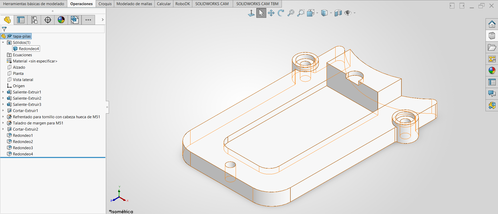
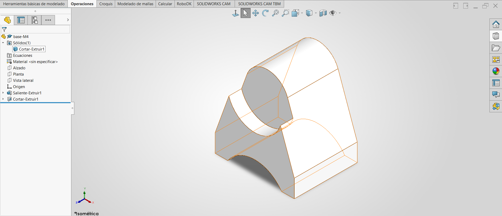
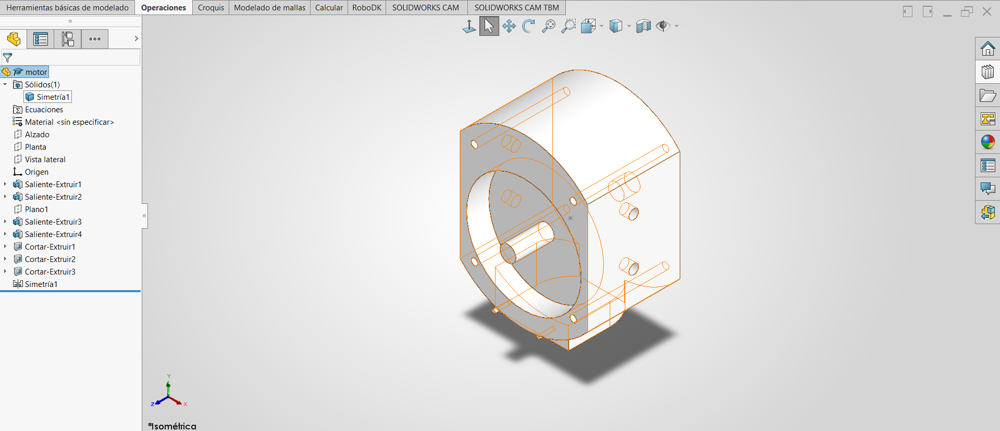

### Lección 8: Modelado Básico de Piezas / Basic Part Modeling
**Fecha:** 08-09-2026  **Tema Principal / Core Topic:** Modelado de Piezas Complejas del Robot (Tapa de Pilas, Soporte Base M4, Bloque de Motor)

---

#### 1. Glosario y Ubicación Rápida (Bilingual Tool Glossary)
*   **Simetría Dinámica de Entidades** (Dynamic Mirror Entities)
    *   *Ubicación / Location:* Buscar en el buscador de comandos (esquina superior derecha). Coloca líneas horizontales paralelas en los extremos de la línea constructiva activa.
    *   *Atajo / Gesto:* Gestos del Ratón (Mouse Gestures).
    *   *Función Clave / Receta:* Todo lo que se dibuja de un lado de la línea constructiva se replica en tiempo real en el lado opuesto.
*   **Convertir Entidades** (Convert Entities)
    *   *Ubicación / Location:* Administrador de Comandos > Croquis > Convertir Entidades.
    *   *Función Clave / Receta:* Proyecta aristas de un sólido 3D existente o curvas de otros croquis directamente sobre tu croquis activo actual. Se pueden arrastrar sus extremos para acortar o alargar la geometría sin perder la relación de proyección.
*   **Asistente para Taladro** (Hole Wizard)
    *   *Ubicación / Location:* Administrador de Comandos > Operaciones > Asistente para Taladro.
    *   *Función Clave / Receta:* Crea barrenos estandarizados (con abocardados, avellanados o roscados). Se definen primero los valores del barreno en la pestaña "Tipo" y luego se indica la ubicación haciendo clic sobre la cara en la pestaña "Posiciones".
*   **Plano Medio** (Mid Plane)
    *   *Ubicación / Location:* Dirección de extrusión/corte > Condición Final.
    *   *Función Clave / Receta:* Distribuye la profundidad de la extrusión o corte de forma simétrica a la mitad de la distancia hacia ambos lados del plano del croquis.
*   **Hasta el Siguiente** (Up to Next)
    *   *Ubicación / Location:* Dirección de extrusión/corte > Condición Final.
    *   *Función Clave / Receta:* Extruye o corta hasta encontrar el primer cuerpo sólido o cara curva en su trayectoria, adaptando la cara final perfectamente a la curvatura del sólido de destino.

---

#### 2. FeatureManager & Lógica del Árbol (Tree Structure)

En esta sesión se trabajó con tres piezas del ensamble del robot. El orden y la lógica de operaciones demuestran cómo estructurar modelos complejos:

##### A. Tapa de Pilas (RM_Tapa_Pilas)
Diseñada en el plano Planta (Top Plane) manteniendo la orientación vertical para el ensamble. El origen se posiciona en el centro del arco concéntrico de radio 50 para asegurar un ensamble automático y sencillo más adelante.

  

*   **Estrategia de Modelado / Intención de Diseño:** Se sigue la regla de oro de la manufactura: primero se agrega todo el material (placa base, cilindros y salientes), después se realizan las operaciones de corte (rebaje plano, barreno abocardado de sujeción y ranura recta), y al final se aplican los redondeos en lote, del más grande al más chico.

##### B. Soporte Base M4 (RM_Base_M4)
Pieza totalmente simétrica que requiere simplicidad extrema en el croquis base.

  

*   **Estrategia de Modelado / Intención de Diseño:** Al extruir en Plano Medio, la geometría se mantiene centrada con respecto al origen de coordenadas, permitiendo que futuras piezas o tornillería se acoplen simétricamente sin necesidad de calcular planos auxiliares de desfase.

##### C. Bloque de Motor (RM_Motor)
Pieza excéntrica y muy detallada que requiere planos auxiliares y adaptabilidad.

  

---

#### 3. Tips, Trucos y Hacks de Velocidad (Speed Hacks)
*   **El Número Mágico de Gestos (Mouse Gestures):** Configurar el menú radial del ratón en **8 gestos**. Cuatro gestos resultan insuficientes para croquizado avanzado, mientras que doce saturan el espacio visual y provocan selecciones erróneas. Ocho es el balance perfecto para tener accesos instantáneos (Smart Dimension, Círculo, Rectángulo, Línea).
*   **El Atajo del Valor Negativo (Inversión de Cota):** Si al colocar una cota numérica la geometría se desplaza hacia el lado contrario del deseado (por ejemplo, hacia adentro de la pieza en vez de hacia afuera), introduce un valor negativo (ej. `-4`). SolidWorks invertirá automáticamente la dirección de la cota sin necesidad de borrarla o mover la figura manualmente.
*   **Creación Exprés de Planos Equidistantes con Ctrl:** Para generar un plano de referencia paralelo de forma instantánea, mantén presionada la tecla **Ctrl** y arrastra con el ratón uno de los planos principales (como Alzado o Planta) desde el árbol flotante de operaciones. Solo suelta el botón y escribe la distancia de desfase deseada.
*   **Medición a Tangencia de Arcos (The Shift Trick):** Al acotar distancias entre un arco y una línea u otro círculo, SolidWorks por defecto toma la distancia de centro a centro. Para acotar a la tangencia exterior o interior máxima (por ejemplo, los 119mm de la Tapa de Pilas), mantén presionada la tecla **Shift** antes de hacer clic en el arco.
*   **Copiado de Croquis mediante Ctrl:** Puedes duplicar rápidamente un croquis completo seleccionándolo directamente en el FeatureManager, manteniendo presionado **Ctrl**, y arrastrándolo hacia el área de diseño.

---

#### 4. ⚠️ Troubleshooting y Errores Comunes
*   **Efecto "Corazón" o "Pico" en Simetría Dinámica:**
    *   *Problema / Síntoma:* Al dibujar un arco cuyo centro geométrico pasa exactamente sobre la línea de simetría mientras la Simetría Dinámica está activa, el arco se duplica incorrectamente creando una figura deforme en forma de corazón o con un pico agudo en el centro.
    *   *Causa y Solución:* La simetría dinámica intenta duplicar el arco sobre sí mismo con un desfase mínimo. Desactiva temporalmente la simetría dinámica para dibujar ese arco central utilizando un **Arco de 3 puntos** convencional, asegurando que sus extremos coincidan limpiamente en los puntos simétricos laterales.
*   **El Eje Flotante o Cortado Accidentalmente:**
    *   *Problema / Síntoma:* Al hacer un corte de caja cilíndrico (como el de Ø36 en el motor) que rodea a un eje de menor diámetro (Ø5), el eje desaparece del modelo 3D tras el corte o genera un error de "geometría flotante/separada".
    *   *Causa y Solución:* El círculo de corte borra todo lo que está dentro de su diámetro. Para evitarlo, dentro del croquis de corte debes seleccionar la arista del eje de Ø5 y pulsar **Convertir Entidades**. Esto genera una línea sólida protectora que le indica a SolidWorks que no debe remover el material del eje, dejándolo intacto dentro de la cavidad cortada.
*   **Error de Reconstrucción de Redondeos:**
    *   *Problema / Síntoma:* Al intentar aplicar redondeos pequeños después de operaciones de corte complejos, la geometría marca errores geométricos o de reconstrucción de bordes.
    *   *Causa y Solución:* Siempre programa tus redondeos de mayor radio a menor radio. Esto permite que los redondeos pequeños se "adapten" a las curvaturas suaves preexistentes en lugar de forzar a que un redondeo grande intente cortar esquinas minúsculas y complejas.