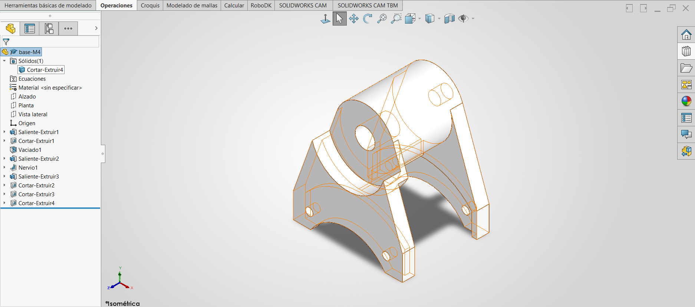
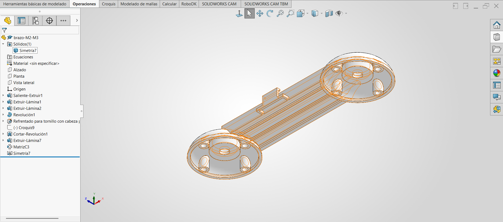

### Lección 9: Vaciado y Edición de Piezas / Shell & Editing Existing Parts
**Fecha:** 04-09-2026  
**Tema Principal / Core Topic:** Operación de Vaciado (Shell), Vaciado Multiespesor, Edición de Piezas Existentes (Base M4 y Brazo M2-M3) y Estrategias de Simetría Robustas

---

#### 1. Glosario y Ubicación Rápida (Bilingual Tool Glossary)
*Registra aquí las herramientas clave utilizadas en esta sesión con su equivalente bilingüe y su ubicación.*

*   **Vaciado** (Shell)
    *   *Ubicación / Location:* Administrador de Comandos > Operaciones > Vaciado (Features > Shell)
    *   *Atajo / Gesto:* Menú de Operaciones
    *   *Función Clave / Receta:* Elimina material interno de un sólido dejando un espesor de pared uniforme en las caras seleccionadas. Al seleccionar una o varias caras en *Caras a eliminar* (Faces to remove), esas superficies se abren y el resto del cuerpo queda hueco.
*   **Vaciado con Espesores Múltiples** (Multi-Thickness Shell)
    *   *Ubicación / Location:* Operación Vaciado > Configuración de más de un espesor (Multi-thickness settings)
    *   *Función Clave / Receta:* Permite asignar un espesor general a la pieza (ej. 5 mm) y definir espesores específicos (ej. 2 mm) para caras seleccionadas individualmente en el cuadro de diálogo secundario.
*   **Nervio** (Rib)
    *   *Ubicación / Location:* Administrador de Comandos > Operaciones > Nervio (Features > Rib)
    *   *Función Clave / Receta:* Crea un elemento de soporte o refuerzo delgado a partir de una sola línea de croquis abierta. El material se extiende automáticamente en 3D hasta chocar con las paredes sólidas existentes.
*   **Corte de Revolución** (Revolve Cut)
    *   *Ubicación / Location:* Administrador de Comandos > Operaciones > Corte de Revolución (Revolved Cut)
    *   *Función Clave / Receta:* Gira un perfil de croquis cerrado alrededor de un eje central para sustraer material en forma circular. Es la alternativa perfecta y más estable al Vaciado cuando se requiere duplicar la operación mediante simetría.
*   **Simetría de Operaciones vs. Simetría de Sólidos** (Feature Mirror vs. Body Mirror)
    *   *Ubicación / Location:* Operaciones > Simetría (Features > Mirror)
    *   *Función Clave / Receta:* *Feature Mirror* intenta duplicar operaciones individuales manteniendo sus condiciones finales. *Body Mirror* copia el cuerpo sólido completo independientemente de cómo se construyó.

---

#### 2. FeatureManager & Lógica del Árbol (Tree Structure)

En esta lección se retoman dos piezas clave diseñadas en lecciones anteriores (Lección 8 y Lección 4) para incorporarles cavidades internas, aligeramiento de material y geometría de acoplamiento.

### Pieza 1: Base M4 (`base-M4`) — Modificación con Vaciado Multiespesor

  

### Pieza 2: Brazo de Robot (`brazo-M2-M3`) — Análisis Comparativo de Intención de Diseño para Simetría

La segunda pieza exige crear dos domos o esferas huecas en los extremos superiores del brazo (diseñado en la Lección 4). El objetivo principal de esta pieza es aprender a estructurar las operaciones para que la simetría funcione de forma limpia y eficiente.

  

---

#### 3. Tips, Trucos y Hacks de Velocidad (Speed Hacks)

*   **Sustitución Estratégica de Vaciado por Corte de Revolución:** Si vas a duplicar una cavidad mediante *Simetría de Operaciones* (Feature Mirror), **evita usar la herramienta Vaciado (Shell)**. Utiliza un *Corte de Revolución* con un croquis equidistante. Los cortes de revolución no dependen de IDs de caras eliminadas y se despejan por simetría sin ningún error.
*   **Haciendo coincidir el diámetro interno sin perder la tangencia:** Al dibujar un croquis de corte circular interno que atraviesa un eje, utiliza **Convertir Entidades** (Convert Entities) en la silueta del eje existente. Esto evita que el corte elimine el cilindro de soporte y lo deje "flotando" en el aire.
*   **El Atajo Shift para Medidas de Tangencia:** Al acotar la altura o posición de la cavidad sobre arcos o cilindros, mantén presionada la tecla **Shift** al dar clic en el arco para fijar la cota a la tangencia exterior en lugar de al centro del arco.
*   **Operación Lámina con "Hasta el Siguiente" para Tubos de Soporte:** Para hacer los 4 pivotes internos de la esfera sin crear croquis complejos, dibuja círculos sencillos con *Matriz Circular de Croquis*, aplica *Operación Lámina (1 mm)* y selecciona la condición final *Hasta el Siguiente* (Up to Next). El tubo se adaptará automáticamente a la curvatura interna de la esfera.
*   **Extrusiones en Plano Medio para Evitar Cálculos de Profundidad:** Al cortar o extruir cavidades simétricas desde el plano central (`Plano Alzado` o `Vista Lateral`), utiliza siempre **Plano Medio** (Mid Plane). Si la pieza cambia de ancho en el futuro, el corte se mantendrá perfectamente centrado sin necesidad de recalcular cotas.

---

#### 4. ⚠️ Troubleshooting y Errores Comunes

*   **¿Por qué falla la Simetría (Mirror) cuando incluye un Vaciado (Shell) o un Nervio (Rib)?**
    *   *Síntoma:* Al intentar aplicar `Simetría de Operaciones` seleccionando la revolución, el vaciado y el nervio, SolidWorks muestra un mensaje de error amarillo/rojo: *"No se puede hacer una matriz de estas operaciones usando matriz de geometría"* o *"El vaciado no se puede despejar"*.
    *   *Causa:* La operación *Vaciado* guarda internamente la cara física exacta que seleccionaste para eliminar (`Face ID`). Al intentar proyectar esa operación al otro lado del plano de simetría, SolidWorks busca esa cara en el lado opuesto antes de crear el sólido, lo cual genera un conflicto geométrico insoluble.
    *   *Solución:* Cambia la técnica de modelado. Sustituye el *Vaciado* por un **Corte de Revolución** y sustituye el *Nervio* por una **Extrusión con Operación Lámina**. De esta forma, todas las operaciones se vuelven autónomas y la simetría se ejecuta al 100% en un solo clic.
*   **El Eje o Cilindro Queda "Flotando" tras un Corte:**
    *   *Síntoma:* Al realizar un corte profundo para alojar el motor o un componente interno, el cilindro del eje central se desconecta de la pieza y queda flotando en el espacio 3D.
    *   *Causa:* El perfil del corte abarcó todo el diámetro del eje sin proteger su contorno.
    *   *Solución:* Edita el croquis del corte, selecciona la arista circular del eje y presiona **Convertir Entidades**. Esto incluye la sección del eje como una "isla" protegida que el corte respetará.
*   **Líneas de Nervio que no chocan con el Sólido:**
    *   *Síntoma:* La operación *Nervio* falla con un mensaje de error de extensión.
    *   *Causa:* La flecha de dirección del nervio apunta hacia el lado abierto o la línea no está proyectada dentro de los límites del sólido.
    *   *Solución:* Invierte la dirección de la flecha de la extrusión del nervio en el panel de propiedades y asegúrate de que la línea de croquis esté en un plano central que atraviese el cuerpo sólido.
