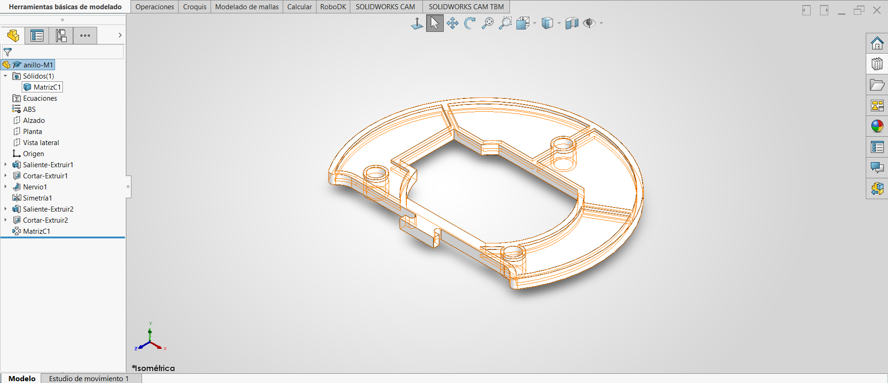
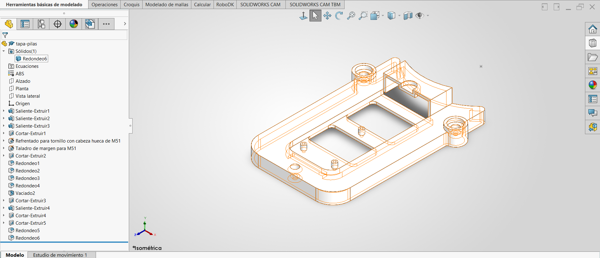

# Lección 10: Equidistancia de Croquis y Edición Avanzada / Sketch Offset & Advanced Part Editing
**Fecha:** 2026-09-24  
**Tema Principal / Core Topic:** Reutilización y modificación de piezas existentes (`anillo-M1` de Lección 3 y `tapa-pilas` de Lección 8) mediante Equidistancia de Entidades, Selección de Bucle y Reordenamiento Temporal en el FeatureManager.

---

### 1. Glosario y Ubicación Rápida (Bilingual Tool Glossary)
*   **Equidistancia de Entidades** (Offset Entities)
    *   *Ubicación / Location:* Administrador de Comandos > Croquis (Sketch) > Equidistancia de Entidades
    *   *Atajo / Gesto:* Menú Croquis / Búsqueda de comandos (`Equidistancia`)
    *   *Función Clave / Receta:* Genera perfiles paralelos internos o externos a una distancia numérica fija manteniendo asociatividad paramétrica con el contorno base.
*   **Seleccionar Bucle** (Select Loop)
    *   *Ubicación / Location:* Clic derecho sobre una arista en el modelo 3D > Seleccionar Bucle (Select Loop)
    *   *Atajo / Gesto:* Flecha de dirección en pantalla para alternar entre bucles adyacentes
    *   *Función Clave / Receta:* Selecciona automáticamente la cadena perimetral continua de aristas que rodean una cara o cavidad, evitando tener que seleccionar aristas una por una.
*   **Barra de Retroceso / Retroceder en el Tiempo** (Rollback Bar)
    *   *Ubicación / Location:* Línea azul/amarilla ubicada en la parte inferior del FeatureManager (Árbol de Operaciones)
    *   *Atajo / Gesto:* Clic sostenido y arrastrar hacia arriba entre las operaciones
    *   *Función Clave / Receta:* Permite "viajar en el tiempo" para insertar operaciones (como nervios o aligeramientos) en una etapa temprana del historial antes de que existan operaciones posteriores, evitando errores de dependencia.
*   **Polígono / Triángulo Equilátero de Referencia** (Polygon Tool)
    *   *Ubicación / Location:* Administrador de Comandos > Croquis > Polígono (definir 3 lados)
    *   *Función Clave / Receta:* Crea un triángulo equilátero inscrito/circunscrito desde el origen para ubicar centros de arreglos circulares de 3 elementos con precisión sin lidiar con ángulos manuales.
*   **Nervio** (Rib)
    *   *Ubicación / Location:* Administrador de Comandos > Operaciones (Features) > Nervio
    *   *Función Clave / Receta:* Genera paredes delgadas de refuerzo a partir de líneas abiertas de croquis proyectándolas hasta topar con las paredes sólidas del modelo.

---

### 2. FeatureManager & Lógica del Árbol (Tree Structure)

#### Pieza 1: Modificación del Anillo M1 (Retomada de la Lección 3)

  

*   **Estrategia de Modelado / Intención de Diseño:**  
    *   *Evitar calcar geometrías complejas:* En lugar de volver a dibujar el contorno curvo del anillo trazado en la Lección 3, se usa `Equidistancia de Entidades` con `Seleccionar Bucle` a 2 mm hacia adentro para generar la cavidad de aligeramiento en segundos.
    *   *Uso estratégico del Rollback Bar:* Se regresa el historial para insertar los nervios y el vaciado **antes** de extruir los tubos cilindricos. De este modo, los postes nacen sobre la superficie ya aligerada sin quedar flotando.
    *   *Plano Medio para Simetría Bidireccional:* Como la pieza base se construyó con Plano Medio respecto al Plano Planta, basta una sola `Simetría` para duplicar el corte de 1 mm de profundidad y los nervios hacia la cara inferior de la pieza.

#### Pieza 2: Modificación de la Tapa de Pilas (Retomada de la Lección 8)

  

*   **Estrategia de Modelado / Intención de Diseño:**  
    *   *Corrección de Fondo de Broca:* Modificar la punta del taladro ciego a 180° (plano) evita que el cono estándar de 118° perforara la pared durante el vaciado.
    *   *Vaciado Multiespesor (Multi-Thickness Shell):* Aplicar 2 mm de espesor general en la carcasa pero definiendo 1.5 mm en las caras de alojamiento interno para no romper la geometría.
    *   *Postes Adaptativos ("Hasta la Superficie"):* Los pivotes de sujeción se extruyen hacia la superficie interior vaciada para que se adapten automáticamente si la profundidad del vaciado cambia en el futuro.

---

### 3. Tips, Trucos y Hacks de Velocidad (Speed Hacks)
*   **Selección de Bucle (Select Loop) en 1 Clic:** Al hacer clic derecho sobre una arista y elegir "Seleccionar Bucle", SolidWorks resalta automáticamente toda la cadena continua de bordes alrededor de la cavidad. Esto evita seleccionar decenas de aristas manualmente al usar `Equidistancia de Entidades`.
*   **Polígono de 3 Lados para Arreglos Triangulares:** Para posicionar 3 elementos circulares separados a 61 mm sin calcular ángulos manuales, se dibuja un `Polígono` de 3 lados centrado en el origen, se convierte a geometría constructiva y se fija una línea horizontal. Sus 3 vértices sirven como centros perfectos.
*   **Regla de Convergencia en Operación Nervio:** Al usar la herramienta `Nervio`, NO pueden converger tres líneas en un mismo punto central (provoca error de reconstrucción). La solución es dibujar una línea continua que pase de lado a lado y conectar la tercera línea en forma de "T".
*   **Atajo de Teclado Shift + Flechas de Dirección:** Mantener presionado `Shift` y usar las flechas del teclado rota la vista 3D en incrementos exactos de 90°.
*   **Fondo Plano en Asistente para Taladro (180°):** Para evitar que el fondo cónico de 118° de un barreno ciego perfore el cascarón en un vaciado posterior, se cambia manualmente el ángulo del fondo a 180° en las propiedades de la operación.
*   **Atajo para Invertir Dirección de Cotas (Signo Menos `-`):** En lugar de borrar una cota o mover manualmente la geometría cuando queda del lado incorrecto, basta con anteponer un signo menos (ejemplo: `-4`) en el cuadro numérico para invertir la orientación de inmediato.

---

### 4. ⚠️ Troubleshooting y Errores Comunes
*   **Problema / Síntoma:** La operación `Nervio` marca error o se "vuelve loca" al intentar crearse a partir de un croquis con tres líneas que se unen en el centro.
    *   *Causa y Solución:* La herramienta `Nervio` no puede resolver geométricamente la intersección de tres líneas abiertas encontrándose en un mismo punto. Se resuelve eliminando la unión central y dejando una sola línea continua que atraviese el origen, conectando la tercera línea en forma de "T".
*   **Problema / Síntoma:** El `Vaciado` (Shell) marca error o genera geometría de espesor cero en la `tapa-pilas`.
    *   *Causa y Solución:* Los barrenos ciegos creados previamente con el Asistente para Taladro tenían la condición cónica de broca a 118° perforando casi hasta la cara opuesta. Se soluciona editando la operación del taladro para establecer una profundidad exacta (7 mm) con fondo plano (180°), además de activar espesores múltiples (1.5 mm) en las caras internas del vaciado.
*   **Problema / Síntoma:** Al borrar una cota de equidistancia (Offset) porque estorba en la pantalla, el croquis pierde su forma paralela y se desbarajusta en color azul.
    *   *Causa y Solución:* La cota numérica de equidistancia es la cota conductora que mantiene vivas las relaciones paramétricas de separación. NUNCA borres la cota de equidistancia; si molesta visualmente, arrástrala fuera de la pieza u oculta las relaciones desde el menú del "Ojo" (Ver relaciones de croquis).
