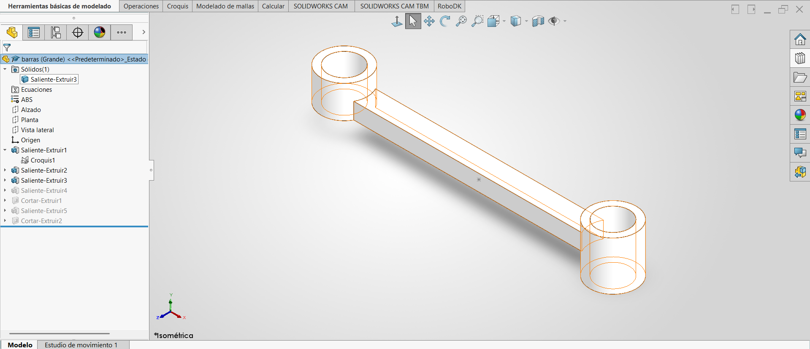
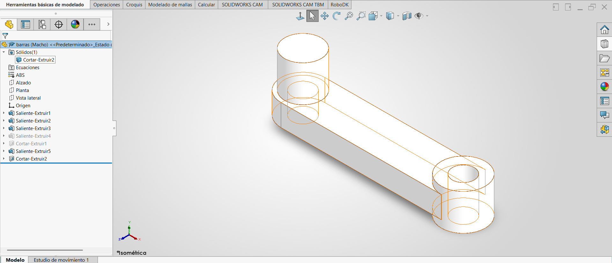
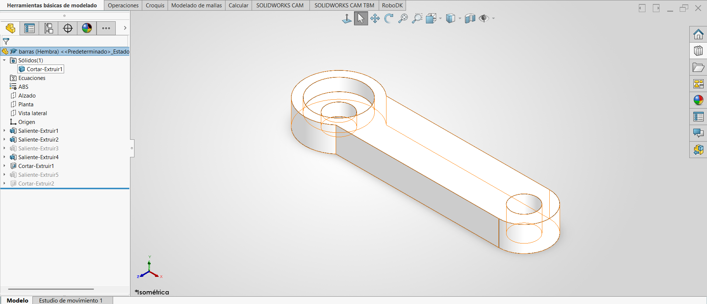

# Lección 11: Configuraciones y Automatización de Diseño / Configurations & Design Automation
**Fecha:** 2026-09-30  
**Tema Principal / Core Topic:** Introducción al Gestor de Configuraciones (ConfigurationManager), control de cotas por configuración, supresión/desactivación de operaciones, relaciones Padre e Hijo (Parent-Child) y automatización de piezas modulares (`barras` de Lección 6).

---

### 1. Glosario y Ubicación Rápida (Bilingual Tool Glossary)
*   **Gestor de Configuraciones** (ConfigurationManager)
    *   *Ubicación / Location:* Pestaña junto al FeatureManager (Árbol de Operaciones) en el panel izquierdo de SolidWorks.
    *   *Función Clave / Receta:* Permite crear, gestionar y alternar entre múltiples versiones/variantes de una misma pieza dentro de un único archivo `.SLDPRT`.
*   **Agregar Configuración** (Add Configuration)
    *   *Ubicación / Location:* Clic derecho sobre el nodo superior raíz del ConfigurationManager > Agregar configuración... (Add Configuration...)
    *   *Advertencia Clave:* NUNCA elegir `Agregar configuración derivada` a menos que se busque crear subfamilias o etapas de maquinado.
*   **Suprimir / Desactivar Supresión** (Suppress / Unsuppress)
    *   *Ubicación / Location:* Clic sobre la operación en el árbol > Tercer icono superior (Cubito azul con flecha hacia abajo a cubito gris)
    *   *Función Clave / Receta:* Enciende o apaga la existencia física de una operación en la configuración activa sin borrarla del archivo. NUNCA usar la tecla `Suprimir/Delete` del teclado.
*   **Asignación de Cota por Configuración** (Dimension Configuration Dropdown)
    *   *Ubicación / Location:* Menú emergente al editar el valor numérico de cualquier cota.
    *   *Función Clave / Receta:* Seleccionar la opción **Esta configuración** (This configuration) para modificar el valor únicamente en la variante activa. Este botón solo aparece cuando existen 2 o más configuraciones en la pieza.
*   **Visualización de Relaciones Padre/Hijo** (Dynamic Reference Visualization)
    *   *Ubicación / Location:* Clic derecho sobre una operación > Relaciones Padre/Hijo (Parent/Child)
    *   *Función Clave / Receta:* Muestra las flechas de dependencia jerárquica: flechas hacia arriba para los "Padres" (geometría base) y hacia abajo para los "Hijos" (operaciones subsecuentes).

---

### 2. FeatureManager & Lógica del Árbol (Tree Structure)

#### Modificación de la Pieza `barras` (Retomada de la Lección 6)

  
  
  

*   **Estrategia de Modelado / Intención de Diseño:**  
    *   *Centralización de Archivos:* Crear las tres variantes (`Grande`, `Hembra` y `Macho`) dentro de un mismo archivo `.SLDPRT` evita la proliferación de decenas de archivos sueltos y simplifica las actualizaciones masivas.
    *   *Independencia de Operaciones para Suprimir:* Para evitar que el cambio en un croquis rompa las demás versiones, se prefiere dividir las geometrías exclusivas (como salientes o cortes parciales) en **operaciones independientes de 3D** que se puedan suprimir o encender en cada configuración.
    *   *Control de Opciones Avanzadas:* Mantener activa la opción `Suprimir operaciones y relaciones de posición nuevas` para que al crear un corte o saliente en la versión Macho, no aparezca por error en la versión Hembra o Grande.

---

### 3. Tips, Trucos y Hacks de Velocidad (Speed Hacks)
*   **Diferencia entre Apagar (Suprimir) y Borrar (Eliminar):** Usar el botón de `Suprimir` (cubo azul a gris) oculta la operación en esa configuración. NUNCA presiones la tecla `Suprimir/Delete` del teclado, ya que eliminará la operación de forma permanente en TODAS las configuraciones del archivo.
*   **Aparición del Botón de Configuración en Cotas:** La casilla para aplicar cotas a "Esta configuración" solo aparece en el cuadro de edición cuando la pieza ya tiene al menos 2 configuraciones creadas.
*   **Copia de Propiedades al Crear Configuraciones:** Toda nueva configuración creada copiará exactamente el estado (cotas y operaciones activas/suprimidas) de la configuración que se encuentre **activa** en ese momento.
*   **Regla de Oro de Automatización:** Para automatizar piezas mediante configuraciones, evita hacer croquis súper complejos con múltiples perfiles dentro. Es mucho más eficiente crear varias operaciones sencillas que se puedan encender o apagar de forma individual.
*   **Evitar Configuraciones Derivadas:** Al hacer clic derecho en el nodo superior para crear una variante, asegúrate de seleccionar `Agregar configuración...` y NO `Agregar configuración derivada`, salvo que estés diseñando subfamilias o etapas de maquinado.

---

### 4. ⚠️ Troubleshooting y Errores Comunes
*   **Problema / Síntoma (Efecto "Volver al Futuro"):** Al suprimir o apagar una operación base ("Padre"), desaparecen automáticamente varias operaciones siguientes ("Hijos") del árbol.
    *   *Causa y Solución:* Las operaciones Hijas fueron croquizadas sobre caras o aristas pertenecientes a la operación Padre. Si el Padre se apaga, las caras de referencia dejan de existir y los Hijos no pueden reconstruirse. Se soluciona croquizando sobre planos de referencia principales (Alzado, Planta, Vista Lateral) o desacoplando las referencias geométricas.
*   **Problema / Síntoma:** Al modificar el valor de una cota en la Versión Hembra, la Versión Grande y la Versión Macho también se cambian involuntariamente.
    *   *Causa y Solución:* Al editar la cota no se seleccionó el botón "Esta configuración" (This configuration) en la ventana emergente de la cota, dejando por defecto "Todas las configuraciones". Se corrige editando la cota y cambiando el alcance a "Esta configuración".
*   **Problema / Síntoma:** Se edita el croquis base para agregar un perfil o recorte exclusivo para la Versión Macho, pero esto genera errores de reconstrucción (puntos coincidentes perdidos o aristas amarillas/rojas) en la Versión Hembra.
    *   *Causa y Solución:* Los cambios estructurales dentro de un mismo croquis afectan a TODAS las configuraciones por igual. Para resolverlo, no agregues detalles exclusivos dentro del croquis compartido; déjalo simple y agrega las variaciones como operaciones 3D independientes (Salientes o Cortes) que puedas suprimir/desactivar en las versiones que no las necesiten.
