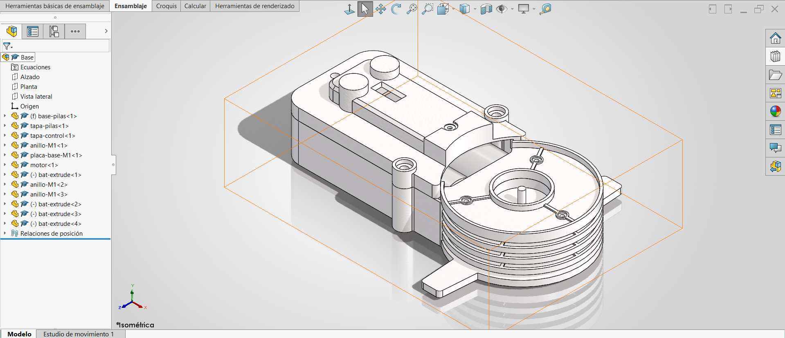

# Lección 12: Ensambles / Assemblies
**Fecha:** 2026-10-02  
**Tema Principal / Core Topic:** Fundamentos de ensambles en SolidWorks (`Base`), inserción correcta de piezas base ancladas al origen, relaciones de posición estándar (Mates) y gestión de archivos.

---

### 1. Glosario y Ubicación Rápida (Bilingual Tool Glossary)

*   **Crear Ensamble desde Pieza** (Make Assembly from Part)
    *   *Ubicación / Location:* Menú Archivo (File) > Crear ensamble desde pieza
    *   *Función Clave / Receta:* Inicia un nuevo archivo de ensamble (`.SLDASM`) importando la pieza activa como componente base inicial.
*   **Insertar Componentes** (Insert Components)
    *   *Ubicación / Location:* Administrador de Comandos > Pestaña Ensamble (Assembly) > Insertar componentes
    *   *Atajo / Gesto:* Arrastrar archivos `.SLDPRT` directamente desde el Explorador de Archivos de Windows al área de trabajo.
    *   *Función Clave / Receta:* Permite incorporar nuevas piezas al entorno 3D para relacionarlas con las existentes.
*   **Relaciones de Posición Estándar** (Standard Mates)
    *   *Ubicación / Location:* Pestaña Ensamble > Relación de posición (Icono de clip / Mate)
    *   *Atajo / Gesto:* Seleccionar dos caras/geometrías manteniendo presionado **Ctrl**, soltar **Ctrl** y elegir la relación en el menú flotante.
    *   *Función Clave / Receta:* Restringe los 6 grados de libertad de los componentes mediante coincidencias (Coincident), concentronicidades (Concentric), tangencias (Tangent), paralelos y distancias.
*   **Fijar / Flotar Componente** (Fix / Float)
    *   *Ubicación / Location:* Clic derecho sobre el componente en la zona de gráficos o en el FeatureManager > Fijar (Fix) / Flotar (Float)
    *   *Función Clave / Receta:* Un componente fijo `(f)` queda inmóvil en el espacio 3D; un componente flotante `(-)` conserva grados de libertad para moverse y relacionarse.
*   **Relación de Posición de Distancia** (Distance Mate)
    *   *Ubicación / Location:* Menú Relaciones de posición > Relaciones de posición estándar > Distancia
    *   *Función Clave / Receta:* Establece una separación numérica fija entre dos caras o planos. En ensambles **no se usan cotas de croquis** para separar piezas; se usan relaciones de distancia.

---

### 2. FeatureManager & Lógica del Árbol (Tree Structure)

  

*   **Estrategia de Modelado / Intención de Diseño:**
    *   **Regla de Oro del Origen (Crucial para Examen CSWA):** La primera pieza del ensamble (pieza base o chasis) **NUNCA** debe colocarse haciendo clic libremente en la zona de gráficos. Al insertar la primera pieza, se debe presionar directamente el botón verde de **Aceptar (Checkmark)** en el PropertyManager. Esto alinea automáticamente el origen de la pieza con el origen absoluto del ensamble `(0,0,0)`, garantizando que los cálculos de masa y centro de gravedad en la certificación sean 100% correctos.
    *   **Uso de Planos Internos para Piezas Inclinadas:** Si una cara externa tiene un ángulo o inclinación (como la tapa de pilas o caras cónicas), usar coincidencias directas en esas caras puede inclinar la pieza. Para mantener la alineación horizontal/vertical perfecta, se relacionan los planos principales de referencia (*Vista Lateral* o *Alzado*) de la pieza directamente con los planos del ensamble.
    *   **Control Gradual de Grados de Libertad:** Cada pieza libre en el espacio 3D tiene 6 grados de libertad (3 de traslación y 3 de rotación). Cada relación de posición aplicada restringe progresivamente estos movimientos hasta definir por completo la posición del componente.

---

### 3. Tips, Trucos y Hacks de Velocidad (Speed Hacks)

*   **Inserción Directa desde Windows:** Arrastrar los archivos `.SLDPRT` desde el Explorador de Windows directo al lienzo 3D de SolidWorks ahorra tiempo de navegación en menús.
*   **Copiar Componentes con Ctrl:** Para duplicar una pieza ya existente en el ensamble (como tornillos, pilas o anillos), mantén presionado **Ctrl** y haz clic sostenido + arrastra la pieza en la pantalla.
*   **Relaciones Rápida al Vuelo (Tecla Ctrl):** Selecciona una cara de la pieza A, mantén presionado **Ctrl**, selecciona una cara de la pieza B y suelta **Ctrl**. Aparecerá una barra de herramientas flotante para aplicar la relación (Coincidente, Concéntrica, Tangente, etc.) sin abrir la ventana emergente de Mates.
*   **Rotación Rápida antes de Relacionar:**
    *   *Clic izquierdo + arrastrar:* Traslada/mueve la pieza en el espacio.
    *   *Clic derecho + arrastrar:* Gira la pieza sobre su propio eje para orientarla correctamente antes de relacionarla.
*   **Atajos para Ocultar y Mostrar Piezas en Ensambles:**
    *   `Shift + Tab` sobre cualquier componente para ocultarlo al instante y poder trabajar en el interior del ensamble.
    *   `Ctrl + Shift + Tab` muestra temporalmente los componentes ocultos en modo transparente; haz clic sobre cualquiera de ellos para volver a hacerlo visible.
*   **Nombres Únicos de Archivo (Prevención de Corrupción de Ensambles):** SolidWorks almacena los componentes en memoria por su nombre de archivo. NUNCA guardes piezas distintas con nombres genéricos como `base.SLDPRT` o `pila.SLDPRT` en carpetas diferentes, ya que SolidWorks cargará la primera que encuentre en RAM y corromperá el ensamble. Usa siempre un prefijo o sufijo único por proyecto (ejemplo: `rm_base_pilas.SLDPRT`).

---

### 4. ⚠️ Troubleshooting y Errores Comunes

*   **Problema / Síntoma:** El centro de gravedad reportado en el cálculo de propiedades físicas no coincide con las respuestas del examen CSWA.
    *   *Causa y Solución:* La primera pieza (pieza base) se insertó haciendo clic manual en un punto cualquiera de la pantalla, dejando su origen desalineado respecto al origen `(0,0,0)` del ensamble. Solución: Haz clic derecho sobre la pieza base, selecciona *Flotar*, elimina las relaciones manuales y aplícale una relación coincidente entre su origen/planos y el origen del ensamble, o elimina la pieza y vuelve a insertarla presionando el botón verde de *Aceptar* sin hacer clic en la pantalla.
*   **Problema / Síntoma:** Al intentar aplicar una relación coincidente entre dos caras, la pieza queda chueca o con un ángulo imprevisto.
    *   *Causa y Solución:* Una de las caras seleccionadas tenía un ligero ángulo de salida o inclinación de diseño. Solución: Despliega la pieza en el árbol flotante del FeatureManager y aplica la relación de posición utilizando sus planos de referencia principales (*Alzado*, *Planta* o *Vista Lateral*).
*   **Problema / Síntoma:** Al abrir un ensamble guardado previamente, aparecen piezas completamente diferentes, desproporcionadas o con errores masivos de relaciones.
    *   *Causa y Solución:* Conflicto de nombres de archivo duplicados en el disco duro. Cuestión de memoria RAM: si tenías abierta otra pieza llamada `pila.SLDPRT` de otro proyecto, SolidWorks la usó en lugar de la pieza original. Solución: Cierra SolidWorks para limpiar la memoria RAM y renombra tus archivos utilizando prefijos o códigos de parte únicos.
