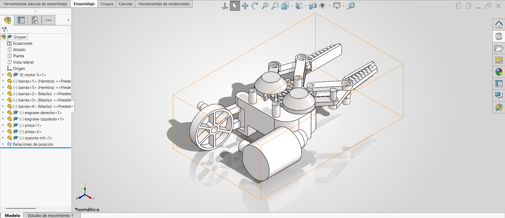

# Lección 13: Relaciones de Posición Avanzadas / Advanced & Mechanical Mates
**Fecha:** 2026-10-02  
**Tema Principal / Core Topic:** Ensamble del mecanismo de pinzas del robot (`Gripper`), relaciones de posición avanzadas (Simetría / Symmetry Mate), relaciones mecánicas (Engrane / Gear Mate) y atajos de velocidad para ensambles (Smart Mates con tecla Alt).

---

### 1. Glosario y Ubicación Rápida (Bilingual Tool Glossary)

*   **Atajo Mates Rápidos con Tecla Alt** (Smart Mates via Alt Key)
    *   *Ubicación / Location:* Zona de gráficos > Presionar tecla **Alt** + Arrastrar componente por una arista o cara
    *   *Función Clave / Receta:* Al arrastrar una arista circular (nacida de una cara plana y una cilíndrica) sobre otra arista con **Alt**, SolidWorks aplica automáticamente **dos relaciones en un solo movimiento**: *Concéntrica* y *Coincidente*.
*   **Relación de Posición de Simetría** (Symmetry Mate)
    *   *Ubicación / Location:* Pestaña Ensamble > Relación de posición > Relaciones de posición avanzadas > Simetría
    *   *Función Clave / Receta:* Vincula dos componentes o caras respecto a un plano central (Plano de simetría) para que al mover una pieza hacia la izquierda/derecha, la otra se mueva proporcionalmente en sentido opuesto.
*   **Relación de Posición de Engrane** (Gear Mate)
    *   *Ubicación / Location:* Pestaña Ensamble > Relación de posición > Relaciones de posición mecánicas > Engrane
    *   *Función Clave / Receta:* Asocia la rotación de dos componentes circulares o engranes seleccionando sus diámetros primitivos o cilíndricos. Permite definir la relación numéricamente (por relación de diámetros o número de dientes).
*   **Suprimir / Desactivar Supresión de Relaciones** (Suppress / Unsuppress Mates)
    *   *Ubicación / Location:* Árbol del FeatureManager > Carpeta Relaciones de posición > Clic derecho en la relación > Suprimir (Suppress)
    *   *Función Clave / Receta:* Apaga temporalmente la restricción de movimiento para poder reorientar o desfasar libremente un componente (por ejemplo, desfasar los dientes de un engrane) antes de reactivar la relación.
*   **Lectura Directa de Distancia en Barra de Estado** (Status Bar Distance Check)
    *   *Ubicación / Location:* Barra de estado inferior de SolidWorks
    *   *Atajo / Gesto:* Seleccionar dos caras planas o cilíndricas manteniendo presionado **Ctrl**
    *   *Función Clave / Receta:* Muestra inmediatamente la "Distancia normal" en la barra inferior sin necesidad de abrir la herramienta Medir (Measure), acelerando la verificación de holguras para coincidencias.

---

### 2. FeatureManager & Lógica del Árbol (Tree Structure)

  

*   **Estrategia de Modelado / Intención de Diseño:**
    *   **Establecer la Pieza Fija Principal:** El componente `motor_5` (carcasa/motor base) actúa como el chasis fijo del ensamble. Al insertarlo mediante el botón de Aceptar (Checkmark), su origen se ancla al origen absoluto del ensamble `(0,0,0)`.
    *   **Sincronización Cinemática del Mecanismo:** Para lograr que las garras de la pinza abran y cierren sincronizadamente se pueden usar dos enfoques:
        1.  *Vía Relación Avanzada de Simetría:* Seleccionando el *Plano Lateral* central del ensamble y las dos caras correspondientes de las garras.
        2.  *Vía Relación Mecánica de Engrane:* Seleccionando los diámetros primitivos o cilíndricos de los engranes izquierdo y derecho (`en_izquierdo` / `en_derecho`).
    *   **Estrategia de Desfase de Dientes (Pregunta Típica de Examen CSWP/CSWA):** Los engranes no son completamente simétricos (si lo fueran, los dientes chocarían entre sí). Para desfasar angularmente una garra respecto a la otra: se *suprime* la relación de engrane, se rota libremente la garra los grados requeridos, y se *desactiva la supresión* de la relación de engrane.

---

### 3. Tips, Trucos y Hacks de Velocidad (Speed Hacks)

*   **Smart Mates con Tecla Alt en 1 Solo Clic:** Para ensamblar pernos, bujes o brazos rápidamente, mantén presionado **Alt** y arrastra una arista circular directamente a la arista de destino. Aplicará concentricidad y coincidencia plana de golpe sin entrar al menú de relaciones.
*   **Truco de Navegación con Alt y Clic Sostenido:** Si necesitas ensamblar una cara trasera que no es visible en pantalla, presiona **Alt**, inicia el arrastre con el clic izquierdo, **suelta Alt sin soltar el clic**, gira libremente la vista 3D con el botón central del ratón y suelta sobre la cara de destino.
*   **Verificar Medidas sin la Herramienta Medir:** Selecciona dos caras con **Ctrl** y observa la barra de estado en la esquina inferior derecha. Si la "Distancia normal" coincide con el ancho de tu pieza (ej. 17 mm), sabrás de inmediato que puedes aplicar una relación de coincidencia directa.
*   **Duplicación Instantánea de Componentes:** Mantén presionado **Ctrl** y arrastra cualquier pieza directamente desde la zona de gráficos para crear una copia idéntica al instante.
*   **Desfase de Engranes en Preguntas de Examen:** Cuando un problema de certificación te pida cambiar el ángulo de apertura de un mecanismo engranado, nunca borres la relación. Simplemente **suprime** la relación de engrane, ajusta la posición de la pieza, y **desactiva la supresión**.

---

### 4. ⚠️ Troubleshooting y Errores Comunes

*   **Problema / Síntoma:** SolidWorks se traba o se cierra inesperadamente al intentar arrastrar y relacionar piezas en ensambles complejos.
    *   *Causa y Solución:* Los conflictos de aceleración gráfica o redundancia de relaciones pueden colapsar la memoria RAM. La herramienta de recuperación automática de SolidWorks rara vez recupera ensambles. **Regla de oro:** Presiona **Ctrl + S** constantemente después de cada subensamble exitoso.
*   **Problema / Síntoma:** El atajo de la tecla **Alt** solo aplica relación concéntrica pero NO la coincidencia de caras.
    *   *Causa y Solución:* Ocurre cuando seleccionas una arista que nace de una cara cónica o curva compleja en lugar de una cara plana limpia. Asegúrate de tomar siempre la arista circular que conecta una cara cilíndrica con una cara totalmente plana.
*   **Problema / Síntoma:** Las garras del mecanismo no se mueven o marcan error de "Ensamble Sobrededefinido" (Over-defined Assembly).
    *   *Causa y Solución:* Ocurre al combinar simultáneamente una *Relación de Simetría* con una *Relación de Engrane* si las distancias entre centros o diámetros no coinciden exactamente. Utiliza solo uno de los dos métodos para controlar la cinemática del mecanismo.
