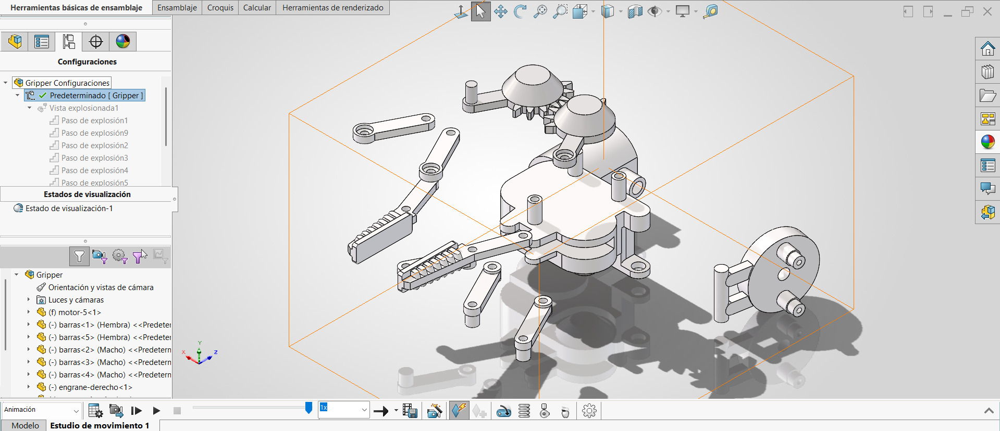

# Lección 14: Detección de Interferencias, Colisiones y Animaciones / Interference Detection, Collision & Animation
**Fecha:** 2026-10-05  
**Tema Principal / Core Topic:** Análisis dinámico y estático de ensambles (`rm_pinza` y robot), detección de interferencias 3D, colisiones dinámicas, resolución de singularidades mecánicas, vistas explosionadas y exportación/compresión optimizada de animaciones a video.

---

### 1. Glosario y Ubicación Rápida (Bilingual Tool Glossary)

*   **Detección de Interferencias** (Interference Detection)
    *   *Ubicación / Location:* Pestaña Calcular (Evaluate) > Detección de interferencias
    *   *Función Clave / Receta:* Analiza la intersección física estática entre piezas. Resalta el volumen en conflicto en **color rojo** y coloca el resto del modelo transparente, reportando el volumen exacto en $\text{mm}^3$.
*   **Detección de Colisión** (Collision Detection)
    *   *Ubicación / Location:* Pestaña Ensamble (Assembly) > Mover componente (Move Component) > Opciones > Detección de colisión
    *   *Función Clave / Receta:* Evalúa interferencias en un estado **dinámico** (mientras arrastras piezas). Permite activar "Detenerse al chocar", emitir un sonido de alerta y resaltar caras que chocan.
*   **Cinemática con Colisiones Físicas** (Physical Dynamics)
    *   *Ubicación / Location:* Pestaña Ensamble > Mover componente > Cinemática con colisiones físicas
    *   *Función Clave / Receta:* Simula el empuje real entre piezas en movimiento (ej. los dientes de un engrane empujando físicamente a otro). Consume muy altos recursos de procesamiento.
*   **Vista Explosionada** (Exploded View)
    *   *Ubicación / Location:* Pestaña Ensamble > Vista explosionada
    *   *Función Clave / Receta:* Desplaza componentes en secuencias por pasos para simular el proceso de ensamble/desmonte sin romper las relaciones de posición (Mates).
*   **Distancia Limitante / Límite de Distancia** (Limit Distance Mate)
    *   *Ubicación / Location:* Pestaña Ensamble > Relación de posición > Relaciones de posición avanzadas > Distancia límite
    *   *Función Clave / Receta:* Define un rango de movimiento con un valor mínimo y máximo de apertura/desplazamiento para mecanismos.

---

### 2. FeatureManager & Lógica del Árbol (Tree Structure)

<p align="center">
  
</p>

*   **Estrategia de Modelado / Intención de Diseño:**
    *   **Estático vs. Dinámico:** Usar *Detección de Interferencias* para validar que las piezas no se solapen estáticamente antes de enviar a impresión 3D o manufactura. Usar *Detección de Colisión* solo para probar rangos extremos de movimiento real.
    *   **Manejo de Recursos Computacionales:** Las colisiones dinámicas consumen una enorme cantidad de memoria y CPU. Por ello, se deben limitar las pruebas a "Componentes seleccionados" o únicamente a la "Pieza arrastrada".
    *   **Gestión de Vistas Explosionadas:** La animación del despiece se controla desde el ConfigurationManager dando clic derecho > *Explosionar la animación*.

---

### 3. Tips, Trucos y Hacks de Velocidad (Speed Hacks)

*   **Prevención de Singularidades en Distancias Límite (El Hack de 0.1 mm):** Evita usar `0 mm` como distancia mínima en relaciones límite. Si la distancia llega exactamente a `0`, SolidWorks se topa con una *singularidad matemática* (raíces múltiples/negativas en las ecuaciones del mecanismo) y el modelo se invierte o se "madrea" hacia el otro lado. Usa `0.1 mm` o `1 mm` para mantener la estabilidad.
*   **Arreglo Rápido de Mecanismos "Madreados":** Si el mecanismo salta una singularidad y se deforma, no borres las relaciones. Suprime (**Suppress**) temporalmente la relación que causó el conflicto, acomoda la pieza manualmente a su posición normal y vuelve a activar la relación (**Unsuppress**).
*   **Verificación Rápida de Volumen de Choque:** Al ejecutar la detección de interferencias, ordena la lista por el volumen en $\text{mm}^3$. Interferencias menores a $0.1 \text{ mm}^3$ a menudo son pequeños chaflanes o tolerancias de modelado; volúmenes grandes indican errores de dimensión o mal ensamble.
*   **Visualización Transparente Mejorada:** Al detectar interferencias, SolidWorks vuelve transparentes los componentes que no están en conflicto para dejar ver el volumen rojo interior. Puedes rotar el modelo en tiempo real para inspeccionar el punto exacto de choque.

---

### 4. 🎬 Exportación y Compresión Optimizada de Animaciones (Guía Especial)

Para guardar animaciones de despiece (vistas explosionadas) o movimiento y enviarlas a producción o clientes sin generar archivos gigantescos:

#### A. Comparativa de Compresores Nativos en SolidWorks
| Compresor | Tipo de Compresión | Peso | Calidad | Uso Recomendado |
| :--- | :--- | :--- | :--- | :--- |
| **Intel IYUV** | Video crudo (YUV), casi sin compresión | Muy Alto | Máxima | **Captura Master / Trabajo profesional** (para editar/recomprimir después) |
| **Full Frames (Uncompressed)** | Sin compresión | El más alto | Máxima | Archivo temporal de prueba |
| **Microsoft Video 1** | Codec antiguo con pérdida | Bajo (ej. $139 \text{ MB} \rightarrow 3.1 \text{ MB}$) | Media | Envíos rápidos si no se desea instalar software externo |

#### B. Flujo Profesional de Exportación Optimizado (Recomendado)
Para obtener archivos ultra ligeros ($\sim 3 \text{–} 10 \text{ MB}$) con **calidad 1080p perfecta** sin pérdida visible de nitidez:

1. **Paso 1 (SolidWorks):** Exporta la animación en formato `.avi` seleccionando el compresor **Intel IYUV** al 100% de calidad (genera el archivo master sin pérdida).
2. **Paso 2 (Recompresión Externa a MP4 / H.264):**
   * **Opción GUI (HandBrake):** Abre el archivo `.avi` en HandBrake, selecciona el preset *Fast 1080p30*, formato `MP4`, códec `H.264`, Factor de Calidad RF 20-22.
   * **Opción CLI (ffmpeg):** Ejecuta la siguiente línea de comando:
     ```bash
     ffmpeg -i animacion.avi -c:v libx264 -crf 20 -preset slow -pix_fmt yuv420p -movflags +faststart animacion.mp4
     ```
3. **Ajustes Complementarios:** Configura la resolución a $1920 \times 1080$ o $1280 \times 720$, tasa de cuadros a 24-30 FPS, y recorta los tiempos muertos al inicio/final de la animación.

---

### 5. ⚠️ Troubleshooting y Errores Comunes

*   **Problema / Síntoma:** Al arrastrar un componente con *Detección de Colisión* activada, la computadora se congela o el movimiento va sumamente lento a tirones.
    *   *Causa y Solución:* La detección de colisiones calcula interacciones geométricas en tiempo real para todos los sólidos del ensamble. Soluciónalo cambiando el alcance en el PropertyManager de "Todos los componentes" a "Componentes seleccionados" (eligiendo únicamente las 2 piezas que entran en contacto) o a "Solo estas piezas".
*   **Problema / Síntoma:** En la animación de la vista explosionada, algunas piezas parecen "atravesar" o chocar agresivamente contra el motor o la carcasa.
    *   *Causa y Solución:* Los pasos de la vista explosionada se registraron en un orden no secuencial. Edita la vista explosionada en el ConfigurationManager y reordena o ajusta los pasos de desplazamiento para que las piezas salgan primero en el eje vertical antes de desplazarse lateralmente.
