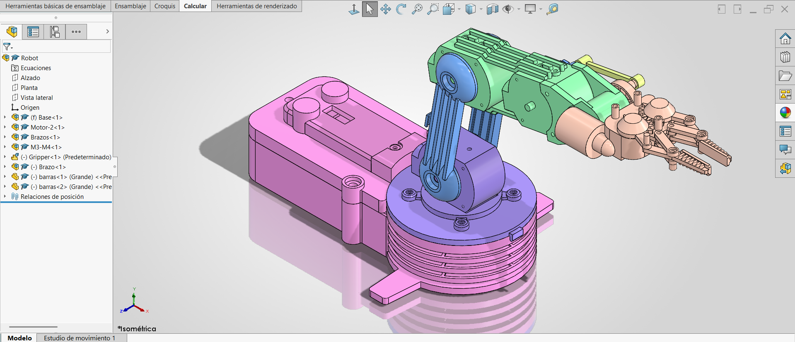

# Lección 15: Subensambles y Ensamble General / Subassemblies & Main Assembly
**Fecha:** 2026-10-05  
**Tema Principal / Core Topic:** Integración final de subensambles en el ensamble principal del Robot (`Robot`), conversión de Subensambles Rígidos a Flexibles, alineación de múltiples orígenes y resolución de conflictos geométricos en mecanismos articulados.

---

### 1. Glosario y Ubicación Rápida (Bilingual Tool Glossary)

*   **Subensamble** (Subassembly)
    *   *Ubicación / Location:* FeatureManager / Pestaña Ensamble > Insertar componentes
    *   *Función Clave / Receta:* Es un archivo de ensamble (`.SLDASM`) insertado dentro de otro ensamble de mayor jerarquía (Ensamble Principal). Funciona como un bloque modular para simplificar la estructura del modelo.
*   **Hacer Subensamble Flexible / Rígido** (Make Subassembly Flexible / Rigid)
    *   *Ubicación / Location:* Clic sobre el subensamble en el FeatureManager o zona de gráficos > Botón flotante "Hacer subensamble flexible" (icono de tres bloques)
    *   *Función Clave / Receta:* Por defecto, SolidWorks importa los subensambles de forma **Rígida** (bloqueando sus movimientos internos). Activarlo como **Flexible** permite que los componentes internos (como las garras de la pinza) se muevan libremente respetando sus relaciones de posición originales.
*   **Alinear Origen con Origen** (Align Origins on Insert)
    *   *Ubicación / Location:* PropertyManager al insertar el primer componente > Botón verde de Aceptar (Checkmark)
    *   *Función Clave / Receta:* Al insertar el primer subensamble (la base), presionar "Aceptar" sin hacer clic en la pantalla alinea automáticamente el origen del subensamble con el origen absoluto del ensamble principal `(0,0,0)`.
*   **Invertir Alineación de Relación de Posición** (Flip Mate Alignment)
    *   *Ubicación / Location:* Menú flotante de Relaciones de Posición / Clic derecho sobre la relación en el árbol > Invertir alineación
    *   *Función Clave / Receta:* Invierte la orientación de los vectores de dirección (ejes) cuando una relación concéntrica o coincidente posiciona una pieza "al revés" de la orientación deseada.
*   **Apariencias por Subensamble** (Component Appearances by Subassembly)
    *   *Ubicación / Location:* Clic derecho sobre el subensamble > Apariencias (Appearance) > Nivel Subensamble
    *   *Función Clave / Receta:* Asigna un color distintivo único a todas las piezas que pertenecen a un subensamble específico, facilitando la identificación visual de los módulos del robot.

---

### 2. FeatureManager & Lógica del Árbol (Tree Structure)

  

*   **Estrategia de Modelado / Intención de Diseño:**
    *   **Jerarquía de Tres Orígenes Coincidentes:** Al insertar el subensamble de la base presionando la palomita verde, se logra una triple coincidencia de orígenes: `Origen de Pieza Chasis = Origen de Subensamble Base = Origen de Ensamble Robot`. Esto garantiza que las propiedades de masa y centro de gravedad en el examen CSWA sean exactas.
    *   **Modularidad de Subensambles:** Dividir el robot en submódulos (`base`, `motor`, `brazos`, `pinza`) evita saturar un solo árbol con docenas de piezas sueltas y permite que varios ingenieros trabajen en componentes separados antes de la integración final.
    *   **Paso de Rígido a Flexible para Cinemática:** Mientras que los motores y la base permanecen rígidos respecto a su chasis, el subensamble de la `pinza` se configura como **Flexible** para permitir el movimiento de apertura y cierre directamente en el ensamble del robot.

---

### 3. Tips, Trucos y Hacks de Velocidad (Speed Hacks)

*   **Smart Mates con Tecla Alt para Subensambles:** Arrastrar la arista circular de un subensamble manteniendo presionada la tecla **Alt** sobre el barreno de destino aplica simultáneamente las relaciones *Concéntrica* y *Coincidente* en un solo movimiento.
*   **Inversión Fluida de Alineación con Tecla Tab:** Si al arrastrar con **Alt** el subensamble queda orientado hacia adentro, presionar la tecla **Tab** antes de soltar el clic invierte la dirección del eje al vuelo.
*   **Asignación de Colores por Código de Subensamble:** Aplicar colores pastel/distintivos a cada subensamble (Rosa para motor, Azul para brazos, Verde para pinza) permite distinguir inmediatamente qué módulo se está moviendo durante las pruebas cinemáticas.
*   **Navegación en Arrastre Continuo:** Iniciar el arrastre con **Alt**, soltar **Alt** mientras se mantiene el clic izquierdo presionado, orbitar la vista 3D con la rueda del ratón y soltar la pieza en la cara posterior.
*   **Lectura Rápida de Distancia en Barra de Estado:** Seleccionar dos caras paralelas con **Ctrl** y revisar la distancia normal reflejada en la esquina inferior derecha de la pantalla sin abrir la herramienta Medir.

---

### 4. ⚠️ Troubleshooting y Errores Comunes

*   **Problema / Síntoma:** El subensamble de las pinzas no se abre ni se cierra al arrastrarlo dentro del ensamble del robot, a pesar de que en su archivo individual sí se mueve.
    *   *Causa y Solución:* Por defecto, SolidWorks importa los subensambles como **Rígidos**. Para solucionarlo, haz clic sobre el subensamble en el árbol y presiona el botón **Hacer subensamble flexible**.
*   **Problema / Síntoma:** Al intentar poner concéntricas las dos barras paralelas del brazo, SolidWorks marca un error catastrófico de relaciones sobredefinidas (texto en rojo).
    *   *Causa y Solución:* Ocurre porque la pinza o el eslabón no están perfectamente paralelos entre sí en el espacio. Antes de aplicar la segunda relación concéntrica, debes agregar una relación de **Paralelo** entre las caras de los eslabones para alinear sus ejes de pivote.
*   **Problema / Síntoma:** Al abrir el ensamble del Robot, todas las piezas muestran signos de interrogación `(?)[0,0,0]` o errores de componentes no encontrados.
    *   *Causa y Solución:* Ocurre cuando se guardan piezas con el mismo nombre (ej. `base.SLDPRT`) en diferentes carpetas. Para evitarlo, abre primero todas las piezas/subensambles individualmente en SolidWorks y luego abre el archivo principal `.SLDASM`.
*   **Problema / Síntoma:** El mecanismo "tiembla" o se invierte de cabeza al intentar arrastrar una pieza.
    *   *Causa y Solución:* Ocurre por **singularidades geométricas** cuando el mecanismo alcanza límites de 0° o 180°. La solución es restringir los grados de libertad mediante relaciones de **Ángulo** fijas o limitar los rangos con *Relaciones de Posición Avanzadas (Ángulo Límite)*.
