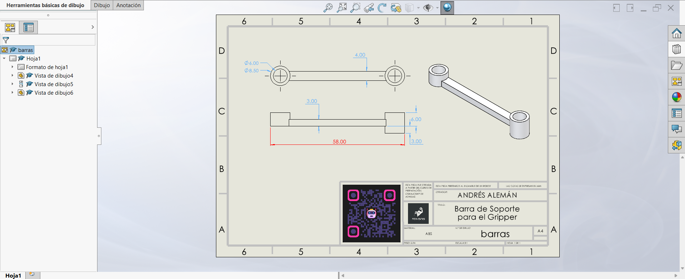

# Lección 16: Dibujo de Piezas y Formato de Hoja Personalizado / Part Drawings & Custom Sheet Format
**Fecha:** 2026-10-06  
**Tema Principal / Core Topic:** Creación de planos de fabricación 2D (`.SLDDRW`) a partir de modelos 3D, configuración de formatos de hoja personalizados, gestión de capas, proyecciones (1er y 3er ángulo) y acotación efectiva para taller.

---

### 1. Glosario y Ubicación Rápida (Bilingual Tool Glossary)

*   **Crear Dibujo desde Pieza** (Make Drawing from Part)
    *   *Ubicación / Location:* Menú Archivo (File) > Crear dibujo desde pieza
    *   *Función Clave / Receta:* Abre un nuevo entorno de dibujo 2D vinculando automáticamente el modelo 3D activo para propagar sus vistas y propiedades asociativas.
*   **Editar Formato de Hoja** (Edit Sheet Format)
    *   *Ubicación / Location:* Clic derecho en cualquier zona en blanco de la hoja > Editar formato de hoja
    *   *Función Clave / Receta:* Activa la capa de edición de fondo para modificar el pie de plano (Title Block), márgenes, logotipos, escala, notas fijas y vínculos de texto a propiedades personalizadas.
*   **Paleta de Visualización** (View Palette)
    *   *Ubicación / Location:* Panel de Tareas (Task Pane en el lateral derecho de la pantalla) > Pestaña Paleta de visualización
    *   *Función Clave / Receta:* Muestra vistas previas automáticas de la pieza (Frontal, Superior, Lateral, Isométrica). Permite arrastrarlas directamente al lienzo de trabajo.
*   **Sistemas de Proyección (1er Ángulo vs 3er Ángulo)** (First Angle vs Third Angle Projection)
    *   *Ubicación / Location:* Clic derecho en zona en blanco > Propiedades (Sheet Properties) > Tipo de proyección
    *   *Función Clave / Receta:* Define cómo se comportan las proyecciones al girar la pieza. El **Tercer Ángulo** (Sistema Americano) coloca la vista superior arriba y la derecha a la derecha; el **Primer Ángulo** (Sistema Europeo) las coloca de forma invertida.
*   **Vista de Sección y Vista de Detalle** (Section View & Detail View)
    *   *Ubicación / Location:* Administrador de Comandos > Pestaña Ver diseño (Drawings) > Vista de sección / Vista de detalle
    *   *Función Clave / Receta:* La *Vista de Sección* corta el modelo 3D con una línea para revelar cavidades o cortes internos; la *Vista de Detalle* genera un círculo de amplificación (zoom local) para acotar geometrías pequeñas.

---

### 2. FeatureManager & Lógica del Árbol (Tree Structure)

  

*   **Estrategia de Modelado / Intención de Diseño:**
    *   **Diferencia entre Formato de Hoja (.slddrt) y Plantilla (.drwdot):** El *Formato de Hoja* contiene únicamente el diseño físico del papel (pie de plano, cuadro de datos, bordes). La *Plantilla de Dibujo* guarda la configuración global del documento (unidades en mm, normas ANSI/ISO, capas de colores, fuentes y precisión de decimales).
    *   **Independencia de Capas:** Trabajar el plano como si fueran "acetatos transparentes". Al asignar las cotas a una capa de color (ej. Azul), las notas a otra (ej. Rojo) y mantener el pie de plano bloqueado en el fondo, el plano queda ordenado, legible y fácil de modificar.
    *   **Asociatividad Bidireccional:** Cualquier cota conductora editada o modificada en la pieza 3D actualizará inmediatamente el plano 2D, y viceversa.

---

### 3. Tips, Trucos y Hacks de Velocidad (Speed Hacks)

*   **Mover y Copiar Cotas con Shift y Ctrl:** 
    *   Para **desplazar** una cota de una vista a otra (ej. mover de la vista frontal a la vista de sección), mantén presionada la tecla **Shift** y arrastra la cota hacia la nueva vista.
    *   Para **copiar** una cota manteniendo la original en su sitio, mantén presionada la tecla **Ctrl** mientras la arrastras.
*   **Acceso Directo a Propiedades de la Hoja:** Si las propiedades de la hoja salen ocultas al hacer clic derecho en el lienzo, usa el menú desplegable inferior o personaliza el menú contextual marcando la casilla de *Propiedades* para cambiar entre sistema Americano (3er ángulo) y Europeo (1er ángulo) en un clic.
*   **Texto Dinámico en Cotas (`2x` / `4x`):** Al hacer clic sobre una cota inteligente en el dibujo, utiliza la barra flotante de opciones o el panel del PropertyManager para agregar el texto `2x ` o `4x ` antes del valor del diámetro/radio. Esto evita poner cotas redundantes en barrenos idénticos.
*   **Estilo de Visualización por Vista:** Puedes configurar la vista isométrica en modo *Sombreado con aristas* (Shaded with Edges) para dar claridad tridimensional, mientras mantienes las vistas ortogonales en *Líneas ocultas visibles* (Hidden Lines Visible) para acotar cortes internos.
*   **Cotas Verificables en Taller:** Diseña tus cotas pensando en el operador y el instrumento de medición (Vernier/Calibrador). Es más fácil verificar una distancia total exterior o un diámetro de tubo con calibrador que un radio externo tangente sin aristas de referencia.

---

### 4. ⚠️ Troubleshooting y Errores Comunes

*   **Problema / Síntoma:** No puedo editar el nombre de la pieza, el logotipo, la escala o la fecha en el cuadro del pie de plano.
    *   *Causa y Solución:* El pie de plano pertenece a la capa protegida del *Formato de hoja*. Haz Clic Derecho en cualquier zona libre de la hoja y selecciona **Editar formato de hoja** (*Edit Sheet Format*). Realiza los cambios en los textos o líneas y luego presiona el icono de salir (flecha en la esquina superior derecha) para volver a la capa de dibujo.
*   **Problema / Síntoma:** Las vistas de dibujo quedan "al revés" de como las espero (por ejemplo, al proyectar la vista hacia arriba me aparece la vista inferior en lugar de la superior).
    *   *Causa y Solución:* La hoja está configurada por defecto en el sistema de **Primer Ángulo (Europeo)**. Ve a Clic Derecho en la hoja > *Propiedades* > cambia el tipo de proyección a **Tercer Ángulo (Americano)**.
*   **Problema / Síntoma:** Al mover o arrastrar una vista de dibujo, se mueven otras vistas a las que no quería alterar.
    *   *Causa y Solución:* Las vistas proyectadas mantienen una alineación ortogonal fija con la vista padre inicial. Si necesitas mover una vista de forma totalmente independiente, haz Clic Derecho sobre ella > *Alineación* > **Romper alineación** (*Break Alignment*).
