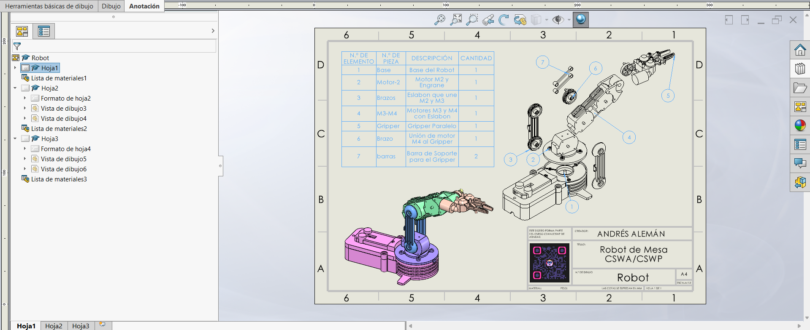

import os
import shutil

content = """# Lección 17: Dibujo de Ensambles / Assembly Drawings
**Fecha:** 2026-10-06  
**Tema Principal / Core Topic:** Elaboración de planos de ensamble 2D en SolidWorks (`Robot_Mesa`), Vistas Explosionadas (Exploded Views), Lista de Materiales (BOM / Bill of Materials), Globos Automáticos (Auto Balloons), Líneas Magnéticas y Vinculación de Propiedades Personalizadas.

---

### 1. Glosario y Ubicación Rápida (Bilingual Tool Glossary)

*   **Vista Explosionada de Ensamble** (Exploded View)
    *   *Ubicación / Location:* Administrador de Comandos > Pestaña Ensamble (Assembly) > Vista explosionada
    *   *Función Clave / Receta:* Crea el despiece tridimensional de componentes y subensambles mediante pasos de dirección ortogonal o de ejes cilíndricos, sirviendo como preparación previa para el dibujo 2D.
*   **Lista de Materiales / BOM** (Bill of Materials)
    *   *Ubicación / Location:* Pestaña Anotaciones (Annotations) > Tablas (Tables) > Lista de materiales
    *   *Atajo / Gesto:* Menú contextual o barra de tablas
    *   *Función Clave / Receta:* Genera la tabla cuantificada de componentes del ensamble en 2D. Ofrece 3 estructuras: *Solo nivel superior* (Top-level only), *Solo piezas* (Parts only) e *Indentado* (Indented).
*   **Globos y Globos Automáticos** (Balloons & Auto Balloons)
    *   *Ubicación / Location:* Pestaña Anotaciones > Globos automáticos (Auto Balloon)
    *   *Función Clave / Receta:* Asigna números indicadores circulares a cada pieza visible en el plano vinculados numéricamente con el ID correspondiente de la Lista de Materiales.
*   **Líneas Magnéticas** (Magnetic Lines)
    *   *Ubicación / Location:* Aparecen automáticamente al insertar *Globos Automáticos* o mediante Anotaciones > Línea magnética
    *   *Función Clave / Receta:* Guías lineales ajustables que alinean y agrupan espacialmente múltiples globos indicadores para mantener el plano limpio y ordenado.
*   **Propiedades Personalizadas de Archivo** (Custom Properties)
    *   *Ubicación / Location:* Menú Archivo (File) > Propiedades > Personalizada / Específica de la configuración
    *   *Función Clave / Receta:* Define metadatos (`Description`, `Material`, `DrawnBy`) en las piezas/subensambles que se propagan automáticamente a las celdas de la Lista de Materiales.

---

### 2. FeatureManager & Lógica del Árbol (Tree Structure)

  

*   **Estrategia de Modelado / Intención de Diseño:**
    *   **Preparación Previa en 3D:** Toda vista explosionada de ensamble debe configurarse en el entorno `.SLDASM` antes de pasarse al plano 2D. Al insertar la vista isométrica en el dibujo, basta activar la casilla *Mostrar en estado explosionado* (*Show in exploded state*).
    *   **Sincronización de Escala (Vista vs. Hoja):** Nunca fuerces una escala personalizada en la vista si vas a usar un pie de plano con anotación dinámica. Cambia siempre la escala directamente en las **Propiedades de la Hoja** (ejemplo `1:3`) para que el rótulo inferior y la vista coincidan sin discrepancias.
    *   **Estructuración de la BOM según el Destinatario:**
        *   *Para Almacén / Compras:* Usar la opción **Solo piezas** (*Parts only*) para sumar el total de elementos individuales idénticos (ejemplo: 7 tornillos totales) sin importar a qué subensamble pertenecen.
        *   *Para Ensamble / Manufactura:* Usar **Solo nivel superior** (*Top-level only*) o **Indentado** (*Indented*) para reflejar la jerarquía modular de montaje.

---

### 3. Tips, Trucos y Hacks de Velocidad (Speed Hacks)

*   **Atajo para Mover Globos en Grupo (Líneas Magnéticas):** Arrastrar el extremo o cuerpo de una *Línea Magnética* mueve todos los globos anclados a ella de forma simultánea y perfectamente alineada, ahorrando decenas de clics manuales.
*   **Espaciar Componentes Automáticamente:** Al crear la *Vista explosionada* en 3D, seleccionar múltiples piezas paralelas y activar la casilla **Espaciar componentes automáticamente** (*Auto-space components*) para crear despieces proporcionales e instantáneos.
*   **Sensibilidad a la Gramática en Propiedades (`Grammar Nazi`):** SolidWorks distingue estrictamente los acentos y el idioma en las propiedades personalizadas. Si la BOM busca la propiedad `Description` (en inglés) o `Descripción` (con acento), debes escribir exactamente el mismo encabezado en la pieza original para que el texto aparezca en la tabla.
*   **Navegación Rápida entre Archivos Abiertos (`Ctrl + Tab`):** Alternar en un milisegundo entre el plano 2D, el ensamble principal y los subensambles para editar propiedades o vistas sin buscar en el menú *Ventana*.
*   **Exportación Directa de la BOM a Excel:** Hacer clic derecho sobre cualquier celda o esquina de la Lista de Materiales en el plano > **Guardar como** (*Save As*) > formato `.XLS` / `.XLSX` para enviar el cómputo de piezas directamente a administración o compras.

---

### 4. ⚠️ Troubleshooting y Errores Comunes

*   **Problema / Síntoma:** La tabla de Lista de Materiales (BOM) muestra celdas vacías en la columna de *Descripción* (*Description*).
    *   *Causa y Solución:* Los archivos de pieza o subensamble no tienen definida la propiedad personalizada correspondiente. Abre la pieza con `Ctrl + Tab`, entra a *Archivo > Propiedades > Personalizada*, agrega el nombre exacto de la propiedad (`Description` o `Descripción`) con su valor y guarda el archivo. La BOM en el dibujo se actualizará automáticamente.
*   **Problema / Síntoma:** En la animación o estado explosionado del ensamble, algunas piezas atraviesan o chocarán geométricamente con otras ("se madrea" la animación).
    *   *Causa y Solución:* Los pasos de la *Vista explosionada* están en un orden incorrecto en el PropertyManager. Edita la operación de la vista explosionada en 3D y arrastra los pasos hacia arriba o hacia abajo en la lista para reordenar la secuencia física de despiece antes de pasarlo al plano.
*   **Problema / Síntoma:** Múltiples hojas dentro de un mismo archivo de dibujo provocan lentitud extrema o riesgo de pérdida total si se daña el archivo.
    *   *Causa y Solución:* Guardar proyectos masivos en un único archivo de dibujo de muchas hojas es riesgoso ante apagones o fallos de RAM. Es más seguro crear archivos `.SLDDRT` independientes por cada subensamble principal y activar en SolidWorks la **Copia de seguridad automática** (*Backup*) en un disco duro secundario.
