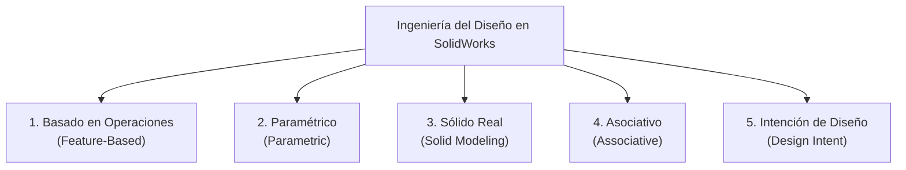
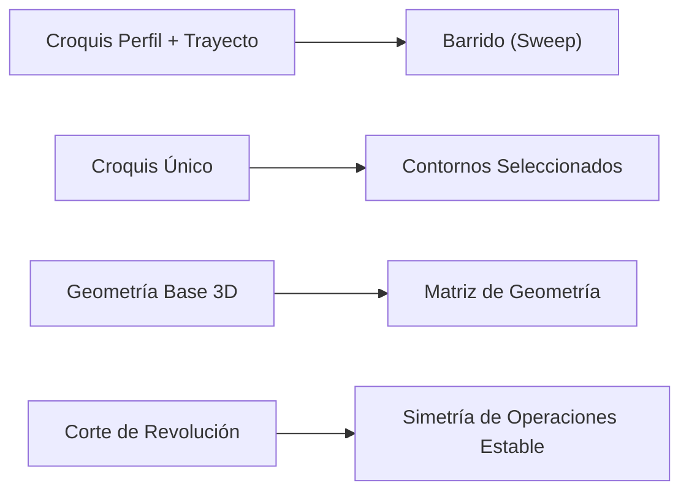

# Curso SolidWorks Básico (CSWA) — Key Design & Modeling Highlights

Bienvenido a la guía ejecutiva y resumen de aprendizajes del **Curso SolidWorks Básico (CSWA)** impartido por **Adnisais**. 

Este repositorio contiene la síntesis completa de **17 lecciones teórico-prácticas** enfocadas en el desarrollo de la *Ingeniería del Diseño*, preparación para la certificación oficial **CSWA (Certified SOLIDWORKS Associate)** y buenas prácticas de modelado paramétrico 3D e ingeniería inversa.

---

## 📌 Navegación del Curso (Lessons Index)

| Lección | Tema Principal | Conceptos Clave |
| :--- | :--- | :--- |
| **00-docs** | [Plantillas & Checklists](./00-docs/) | Guias de croquizado, plantillas y árboles de referencia |
| **Lección 01** | [Introducción y Fundamentos CAD](./01-leccion-intro/README.md) | Los 5 pilares, Test del Jefe Bipolar, Cotas Conductoras |
| **Lección 02** | [Interfaz y Revolución](./02-leccion-croquis/README.md) | CommandManager, Barra de Estado, Pila D (Por Capas vs Revolución) |
| **Lección 03** | [Consejos de Croquis](./03-leccion-consejos-croquis/README.md) | Simetría Dinámica, Recorte Inteligente, Anillo de Motor |
| **Lección 04** | [Simetría y Operación Lámina](./04-leccion-simetria-croquis/README.md) | Mirror Entities, Thin Feature, Plano Medio, Brazo Robótico |
| **Lección 05** | [Barridos (Swept Features)](./05-leccion-barridos/README.md) | Perfil + Trayecto, Relación de Perforar (Pierce), Palanca |
| **Lección 06** | [Selección de Contornos](./06-leccion-contornos/README.md) | Croquis compartidos, Contornos seleccionados, Barras |
| **Lección 07** | [Matrices & Asistente para Taladro](./07-leccion-matrices/README.md) | Matriz Circular, Hole Wizard, Matriz de Geometría |
| **Lección 08** | [Modelado Básico de Piezas](./08-leccion-modelado-piezas/README.md) | Tapa de Pilas, Base M4, Bloque de Motor, Planes aux |
| **Lección 09** | [Vaciado y Edición](./09-leccion-vaciados/README.md) | Shell multiespesor, Nervios, Vaciado vs Corte de Revolución |
| **Lección 10** | [Equidistancia & Retroceso](./10-leccion-equidistancia-croquis/README.md) | Offset Entities, Select Loop, Rollback Bar (Línea de retroceso) |
| **Lección 11** | [Configuraciones y Automatización](./11-leccion-configuraciones/README.md) | ConfigurationManager, Supresión de operaciones, Relaciones Padre/Hijo |
| **Lección 12** | [Ensambles Basicos](./12-leccion-ensambles/README.md) | Anclaje al origen `(0,0,0)`, Relaciones estándar (Mates), Nomenclatura |
| **Lección 13** | [Relaciones Avanzadas y Mecánicas](./13-leccion-relaciones-posicion-avanzadas/README.md) | Smart Mates (Alt), Simetría (Symmetry), Engranes (Gear Mate), Gripper |
| **Lección 14** | [Interferencias & Animación](./14-leccion-deteccion-interferencias/README.md) | Detección de colisiones, Vistas explosionadas, Exportación H.264/MP4 |
| **Lección 15** | [Subensambles y Ensamble General](./15-leccion-subensambles/README.md) | Integración del Robot, Subensambles Rígidos vs Flexibles, Orígenes |
| **Lección 16** | [Dibujo de Piezas 2D](./16-leccion-dibujo-piezas/README.md) | Formato de hoja (`.slddrt`), 1er vs 3er Ángulo, Vistas de Sección |
| **Lección 17** | [Dibujo de Ensambles & BOM](./17-leccion-dibujo-ensambles/README.md) | Lista de Materiales (BOM), Globos automáticos, Líneas magnéticas |

---

## 🧠 Los 5 Pilares de la "Ingeniería del Diseño"

El modelado profesional en SolidWorks trasciende la simple digitalización 3D; se rige por cinco principios fundamentales:



1. **Modelado Basado en Operaciones (Feature-Based):** Construcción secuencial mediante pasos lógicos registrados en el FeatureManager (árbol de operaciones) que simulan los procesos de manufactura reales.
2. **Modelado Paramétrico (Parametric):** Control geométrico donde **primero se define la forma** (mediante relaciones geométricas como horizontal, vertical, colineal, tangente) y **después el tamaño** (con cotas conductoras).
3. **Modelado Sólido (Solid Modeling):** Creación de volúmenes físicos reales con densidad, masa, centro de gravedad y propiedades mecánicas evaluables en simulación (FEA).
4. **Modelado Asociativo (Associative):** Conexión bidireccional activa donde cualquier cambio propago en una pieza (`.SLDPRT`) se actualiza automáticamente en el ensamble (`.SLDASM`) y en los planos 2D (`.SLDDRW`).
5. **Intención de Diseño (Design Intent):** Planificación previa de cómo reaccionará el modelo ante órdenes de cambio inesperadas. 

> [!TIP]
> **El Test del Jefe Bipolar (Lección 1):** Lo que parece más rápido al iniciar un croquis (p. ej. hacer un sólido por Revolución de un solo croquis denso) suele ser lo más rígido ante cambios de diseño. Dividir geometrías en operaciones independientes o por capas otorga máxima flexibilidad para modificar o suprimir componentes en segundos.

---

## 🛠️ Key Modeling & CAD Highlights

### 1. Estrategias de Croquizado 2D
* **Regla de Oro de las Cotas:** *Forma primero, tamaño después.* Define relaciones geométricas (Igual, Tangente, Colineal, Perforar) antes de aplicar cotas inteligentes.
* **Simetría Eficiente:** Usar `Simetría Dinámica` para geometrías simétricas vivas o la selección rápida con ventana verde (de derecha a izquierda cruzando el eje constructivo) para crear espejos automáticos en un clic (`Simetría de Entidades`).
* **Selección de Contornos y Croquis Compartidos (Lección 6):** Un único croquis maestro puede alimentar múltiples extrusiones y cortes independientes. Esto mantiene centrada la intención de diseño y reduce el desorden visual.

### 2. Operaciones 3D Avanzadas y Robustez
* **Barridos con Relación de Perforar (Pierce Relation, Lección 5):** Esencial para fijar la sección transversal del perfil a la trayectoria en espacio 3D, evitando deformaciones en espiral.
* **Operación Lámina (Thin Feature):** Permite generar espesores de pared constantes sobre perfiles abiertos o cerrados sin necesidad de trazar geometrías dobles desfasadas en el croquis.
* **Matrices 3D Seguras (Lección 7):** Seleccionar las operaciones a duplicar **directamente desde el árbol flotante del FeatureManager**, nunca desde las caras del modelo en pantalla. Activar **Matriz de Geometría (Geometry Pattern)** para congelar condiciones finales e incrementar la velocidad de reconstrucción.
* **Vaciado vs Corte de Revolución (Lección 9):** La herramienta `Vaciado` (Shell) guarda identificadores internos de caras (`Face ID`). Si se necesita duplicar la cavidad mediante una `Simetría de Operaciones` (Feature Mirror), sustituir el vaciado por un **Corte de Revolución** para prevenir fallos de reconstrucción.



### 3. Configuraciones y Automatización Paramétrica (Lección 11)
* **ConfigurationManager:** Permite almacenar familias de piezas (`Grande`, `Hembra`, `Macho`) en un solo archivo `.SLDPRT`.
* **Regla de Supresión:** Usar **Suprimir (Suppress)** para desactivar operaciones en una configuración específica. *Nunca presionar la tecla Delete/Suprimir del teclado*, ya que eliminará permanentemente la operación de todas las variantes.
* **Aislamiento de Dependencias (Padre/Hijo):** Para evitar el efecto "Volver al Futuro" (donde apagar un Padre borra los Hijos), croquizar siempre sobre los planos principales (*Alzado, Planta, Vista Lateral*) en lugar de apoyarse sobre caras de operaciones que pueden ser suprimidas.

### 4. Integración de Ensambles y Mecanismos (Lecciones 12–15)
* **La Regla de Oro del Origen CSWA (Lección 12):** La primera pieza (chasis o base) **NUNCA** se inserta haciendo clic libre en la pantalla. Debe insertarse haciendo clic en el botón verde de **Aceptar (Checkmark)** del PropertyManager. Esto alinea automáticamente:
  $$\text{Origen de Pieza Base} = \text{Origen del Ensamble } (0,0,0)$$
  Garantizando que las propiedades de masa y centro de gravedad en la certificación sean 100% correctas.
* **Smart Mates con Tecla Alt (Lección 13):** Arrastrar la arista circular de un perno o buje manteniendo presionado **Alt** sobre la arista de destino aplica relaciones *Concéntrica* y *Coincidente* simultáneamente.
* **Evitar Singularidades Mecánicas (Lección 14):** En relaciones de *Distancia Límite*, evitar usar `0 mm` como cota mínima para prevenir que el solver matemático invierta las ecuaciones. Usar `0.1 mm` o `1 mm` para mantener la estabilidad del mecanismo.
* **Subensambles Flexibles (Lección 15):** Cambiar un subensamble de estado *Rígido* a **Flexible** para habilitar sus grados de libertad internos (como la apertura de pinzas o articulaciones) dentro del ensamble maestro.

### 5. Análisis, Animación y Planos de Manufactura 2D (Lecciones 14, 16–17)
* **Exportación de Animaciones en Alta Calidad / Bajo Peso:**
  1. Exportar en SolidWorks mediante el compresor sin pérdida **Intel IYUV** (`.avi`).
  2. Recomprimir externamente a formato `MP4 / H.264` usando HandBrake o `ffmpeg`:
     ```bash
     ffmpeg -i animacion.avi -c:v libx264 -crf 20 -preset slow -pix_fmt yuv420p animacion.mp4
     ```
* **Formato de Hoja (`.slddrt`) vs Plantilla (`.drwdot`):** El formato contiene la gráfica del papel y pie de plano; la plantilla almacena unidades, decimales y normas ISO/ANSI.
* **Sistemas de Proyección (Lección 16):** Configurar la hoja en **Tercer Ángulo** (Sistema Americano) en las propiedades de la hoja para planos estándar de la industria.
* **Automatización de Listas de Materiales (BOM & Auto Balloons):** Usar *Líneas Magnéticas* para alinear globos de ensamble y vincular propiedades personalizadas (`Description`, `Material`, `DrawnBy`) directamente al pie de plano y tablas.

---

## ⚡ Hacks de Velocidad y Atajos Clave

| Atajo / Hack | Acción / Función | Beneficio en Examen CSWA |
| :--- | :--- | :--- |
| `Ctrl + 1..7` | Cambiar vistas estándar (Frontal, Superior, Isométrica) | Reorientación instantánea del modelo |
| `Ctrl + 8` | Vista Normal a la cara o plano seleccionado | Alineación perpendicular para croquizar |
| `Tecla Shift` + Cota | Acotar a la **tangencia exterior/interior** de arcos | Evita acotar de centro a centro por defecto |
| `Tecla Alt` + Arrastrar | **Smart Mates** en ensambles (Concéntrica + Coincidente) | Ensamble de pernos/conectores en 1 segundo |
| `Shift + Tab` | Ocultar componentes sobre los que flota el cursor | Permite ver el interior de ensambles sin menús |
| `Ctrl + Shift + Tab` | Mostrar componentes ocultos en modo transparente | Recupera visualización de piezas rápida |
| Signo Menos (`-4`) | Introducir valor negativo en la cota emergente | Invierte la dirección de la cota sin borrarla |
| `Rollback Bar` | Arrastrar la barra azul inferior del FeatureManager | Permite insertar operaciones en el pasado |
| **8 Gestos del Ratón** | Personalizar rueda radial con clic derecho | Accesos ultrarrápidos a Cota, Línea, Círculo |

---

## ⚠️ Troubleshooting: Errores Comunes & Soluciones

> [!WARNING]
> **1. Error de Geometría de Espesor Cero (Zero-Thickness Geometry):**
> * *Causa:* Ocurre al extruir una pestaña o saliente que toca tangencialmente un cilindro o cara en un borde infinitesimal.
> * *Solución:* Dibujar un traslape ("cachito" de material extra) que penetre ligeramente dentro del cuerpo sólido para que se fusionen de forma maciza.

> [!CAUTION]
> **2. El Centro de Gravedad no coincide en el Examen CSWA:**
> * *Causa:* La pieza base o chasis se insertó con clic libre en pantalla, desalineando el origen de la pieza con el origen del ensamble `(0,0,0)`.
> * *Solución:* Dar clic derecho a la pieza base > *Flotar*, y aplicar coincidencia entre su origen/planos y el origen del ensamble.

> [!WARNING]
> **3. Fallo de Reconstrucción en Operación Nervio (Rib):**
> * *Causa:* Intentar hacer converger 3 líneas abiertas en un mismo punto central dentro del croquis del nervio.
> * *Solución:* Trazar una sola línea continua de extremo a extremo y conectar la tercera línea en forma de "T".

> [!NOTE]
> **4. Pérdida de Referencias al Modificar Cotas de Equidistancia (Offset):**
> * *Causa:* Borrar la cota numérica de equidistancia creyendo que es sobrante.
> * *Solución:* NUNCA borrar la cota conductora de equidistancia; si estorba visualmente, ocultar las relaciones de croquis desde el menú del Ojo (*Ver relaciones*).

---

## 📂 Recursos y Archivos de Referencia

* **Checklist de Croquis:** Consulte [`00-docs/cswa-sketch-checklist.md`](./00-docs/cswa-sketch-checklist.md) antes de cada modelo.
* **Plantilla de Notas:** Consulte [`00-docs/cswa-note-template.md`](./00-docs/cswa-note-template.md) para el formato estandarizado.
* **Recursos de Almacén:** Piezas originales e insumos del instructor en [`99-resources/`](./99-resources/).
